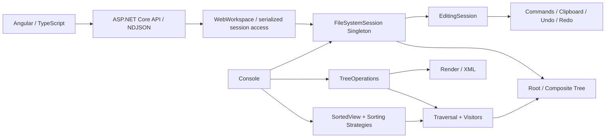
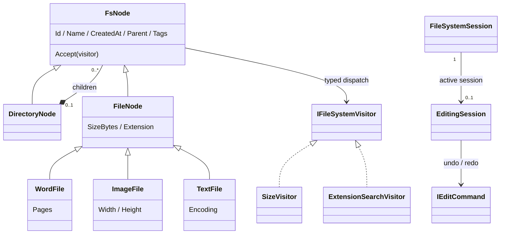
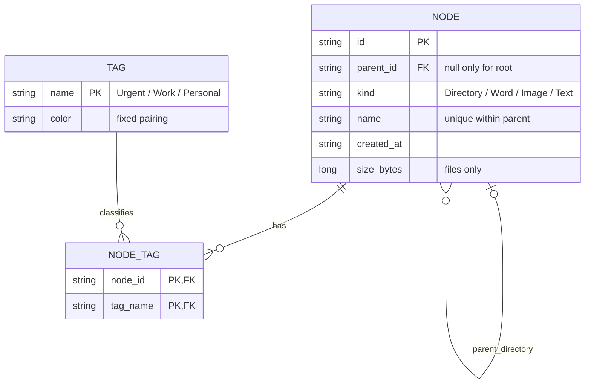

# CloudFileManager

## 1. Project Overview

以 **Angular + TypeScript / ASP.NET Core / .NET 10** 實作的雲端檔案管理領域模型作業，展示樹狀模型、可復原的編輯操作、七種 Design Patterns，以及可追溯的 AI Agent 開發過程。

目前提供互動式 Web UI 與 Console，完成 mandatory requirements 與 Bonus。Angular 僅管理畫面；ASP.NET Core API 與 C# Core 是唯一 domain authority。這是記憶體中的檔案模型，沒有真實雲端上傳、檔案內容讀寫或資料庫存取。最新 migration 驗證狀態見 [TASK-006](spaces/angular-frontend-migration/status.md)。

快速閱讀：[架構](#3-architecture-overview) → [七種 Patterns](#6-design-patterns) → [演進](#9-architecture-evolution) → [執行](#10-build--run)／[驗證](#11-testing--verification)。

## 2. Assignment Requirements & Implemented Features

| 作業要求 | 實作與驗證入口 |
|---|---|
| Domain Model / UML、ER Model | 下方目前模型、[詳細 Domain Model](spaces/visitor-singleton-enhancement/sa/domain-model.md)、[ER](spaces/visitor-singleton-enhancement/sa/er-model.md) |
| 檔案與目錄、型別 metadata | [Nodes](src/CloudFileManager.Core/Nodes.cs)：名稱、建立時間、大小；Word 頁數、Image 寬高、Text 編碼；檔案必須屬於目錄 |
| 指定範例樹與詳細資訊 | [SampleTree](src/CloudFileManager.Core/SampleTree.cs)、Console 預設輸出：4 個目錄、5 個檔案 |
| 任意目錄的完整子樹容量 | `TreeOperations.CalculateTotalSize`；空目錄為零，checked long 防止溢位 |
| 副檔名搜尋 | `TreeOperations.SearchByExtension`；包含子目錄與完整路徑，接受有／無點號與大小寫變化 |
| XML 結構與內容 | `TreeOperations.ToXml`；名稱合法化、碰撞處理與 escaping；[原題 XML fixture](tests/CloudFileManager.Tests/Fixtures/expected.xml) |
| 演算法訪問紀錄 | 容量與搜尋依 DFS 印出 `Visiting:`，每節點一次；[Core tests](tests/CloudFileManager.Tests/Program.cs) 核對順序與結果 |

容量採二進位：**1 KB = 1024 B、1 MB = 1024 KB**，內部保存整數 bytes。測試從原始五筆資料獨立換算，產品不硬編碼總容量。遍歷以明確 stack 處理深層樹，避免遞迴呼叫堆疊限制。建立時間為固定示範值；XML 是題目展示格式，不是可逆保存協定。

## 3. Architecture Overview



- **Domain**：Node 控制結構與 ownership；外部不可任意設定 Parent 或修改 Children 集合。
- **Operations**：Traversal 管 DFS 與 logging；Visitor 管容量／搜尋／XML；Strategy 管排序鍵與方向；Command 管編輯及復原。
- **Lifecycle**：`FileSystemSession` 持有 Root 與私有 `EditingSession`。`Reset(newRoot)` 替換 Root、清空 Clipboard／Undo／Redo，不屬於 Command、不可 Undo；非法 Root 保留原狀態。

**Single-threaded application session**：Root、Clipboard、Command History、Reset 不承諾 thread-safe，Core 本身不加入 locking；WebWorkspace 在 API boundary 序列化 session 存取。Singleton 唯一性不等於 thread safety。首次使用須 Reset 初始化；外部 Add* 應在建立 session 前完成，之後直接改樹會觸發既有 revision 過期檢查。

## 4. Domain Model / UML



只有 Root 的 Parent 為 null；其他目錄與所有檔案均有一個父目錄。Delete 移出活樹，但 Command 保留原節點及位置供 Undo；Paste 建立獨立新 ID 與父子關係，不把原節點掛到兩處。

完整 runtime composition 與生命週期限制見 [TASK-003 Domain Model](spaces/visitor-singleton-enhancement/sa/domain-model.md)／[架構決策](spaces/visitor-singleton-enhancement/sa/design.md)。

## 5. ER Model



上圖為閱讀摘要。完整欄位與約束見 [schema.sql](schema.sql)、[schema-tags.sql](schema-tags.sql)、[詳細 ER](spaces/visitor-singleton-enhancement/sa/er-model.md)：TPH 映射繼承、父節點必須是 Directory、至多一個 Root、型別 metadata CHECK、同層名稱唯一、Tag 關聯不可重複。頁數、解析度、編碼與 XmlAlias 依型別限制。

SQLite schema 用於驗證 ER，應用仍是記憶體模型。Clipboard、History 與 Singleton context 不持久化，也不新增 session 資料表。

## 6. Design Patterns

| Pattern | Concrete problem / 為何適合 | Implementation / 使用位置 | Trade-off |
|---|---|---|---|
| **Composite** | 目錄與三種檔案需要同一套樹狀訪問及子樹操作；共同節點型別避免呼叫端重建拓撲 | [FsNode / DirectoryNode / FileNode](src/CloudFileManager.Core/Nodes.cs)；範例樹、遍歷、編輯皆使用 | 必須維護父子 ownership；不開放任意 reparent |
| **Strategy** | 執行時切換名稱、大小、副檔名、標籤排序；分開鍵計算與顯示順序 | [INodeSortStrategy、Name/Size/Extension/TagSortStrategy、SortedView](src/CloudFileManager.Core/Sorting.cs)；Bonus 排序 | 比單一 switch 多介面與類別，但可獨立測試／替換策略 |
| **Command** | Delete、Paste、Tag 加減須各自保留復原資訊，並共用線性歷史 | [IEditCommand、DeleteCommand、PasteCommand、TagCommand、EditingSession](src/CloudFileManager.Core/EditingSession.cs)；Bonus 編輯與 Undo/Redo | 保存節點、快照及歷史占用記憶體；操作須維持成功／失敗一致性 |
| **Visitor** | 在穩定 Node types 上分離容量、搜尋與 XML operations；新增 operation 不需把演算法塞入 Node | [IFileSystemVisitor、SizeVisitor、ExtensionSearchVisitor、FileSystemTraversal](src/CloudFileManager.Core/Visitors.cs)；TreeOperations、XML 匯出與大小排序；XmlExportVisitor | 新增 Node type 須更新 visitor 介面及實作；每次操作建立新 accumulator |
| **Singleton** | 明確需要 application-wide Root、Clipboard 與 History context；集中初始化／Reset | [FileSystemSession.Instance](src/CloudFileManager.Core/FileSystemSession.cs)；Program 與 BonusDemo 實際使用，委派 EditingSession | 全域 mutable state 需測試隔離且不 thread-safe；DI singleton 可由容器管理生命週期，Web 使用 DI 管理 WebWorkspace，但保留既有 GoF FileSystemSession；其 API 存取序列化 |
| **Observer** | UI 需要接收真實 traversal 進度，而不讓 Visitor 依賴畫面 | TraversalProgressSource.Progressed → WebWorkspace → NDJSON → Angular ObserverPanel | 每次 operation 訂閱並釋放；進度不是 timer 模擬 |
| **Prototype** | Copy 當下保存完整獨立快照，來源後續修改不得影響 Paste | INodePrototype / NodeSnapshot → EditingSession Copy／Paste | 完整子樹快照占記憶體；貼上仍由 Command 維護原子性與 history |

**Production paths**：容量／搜尋由 [Program](src/CloudFileManager.Console/Program.cs) → [TreeOperations](src/CloudFileManager.Core/TreeOperations.cs) → Traversal → `Accept` → typed Visitor；[BonusDemo](src/CloudFileManager.Console/BonusDemo.cs) 編輯透過 `FileSystemSession.Instance` 共用 Clipboard 與 History。兩者都不是只有 class 或 test。

Visitor 不接管所有操作：Render 保持原責任；TASK-004 加入 XmlExportVisitor，集中 XML traversal／serialization state 並保持原 contract。替代方案與取捨見 [TASK-002 設計](spaces/design-pattern-enhancement/sa/design.md)／[TASK-003 ADR](spaces/visitor-singleton-enhancement/sa/design.md)。

## 7. Bonus Features

| 功能 | 已實作行為 |
|---|---|
| Sorting | Directory 永遠優先；各組按 Name／Size／Extension／Tag 升降冪。文字忽略大小寫、同鍵穩定、不加次排序；目錄大小取完整 subtree、Extension 空值。只改 view，不改 Children／traversal／XML |
| Delete | 可刪整棵非空子樹、保護 Root；Undo 回復原位置、ID、metadata、Tags |
| Copy / Paste | Copy 當下完整快照；來源後續變動／刪除不影響 Paste。新副本獨立；同名採 Ordinal 拒絕，不改名、不覆蓋、不留部分變更 |
| Tags | 檔案與目錄可同時有 Urgent 紅、Work 藍、Personal 綠；Console 顯示名稱與顏色，不改 XML |
| Undo / Redo | 僅成功且實際改變 domain 的新操作建立 entry 並清 Redo；失敗、no-op、Copy、Sorting 不影響歷史 |

`--bonus` 是可重現的 Console 示範，非互動式檔案瀏覽器；底層 API 可由呼叫端選取節點並操作。

## 8. AI Agent Development Workflow

`Human Request → PM → Grill Me → SA → Grill Me → DEV → Grill Me → TEST → Grill Me`

各角色在工作中與交接前，以專案版 **Grill Me** 挑戰需求、設計、實作與驗證假設。同一 agent 依序切換角色，不宣稱四個獨立 agents 審查。

- **Gate**：PASS 才交接；REVISE 退回適當角色；BLOCK 等待必要答覆／條件。現有紀錄的對應名稱為 `PASS / REWORK / BLOCKED`。
- **Human-in-the-loop**：影響驗收的問題標 OPEN 等待 Human；區分 USER_CONFIRMED、SOURCE、ROLE_DECISION、AI_PROPOSAL，不把提案當答案。
- **Persistent Markdown artifacts**：每個 `spaces/<task>/` 保留 request、requirements、design、grill-me、handoff、status、timeline、test report、summary。
- **失敗不覆寫**：保存失敗 evidence、REWORK 原因、責任角色、修正及重驗輪次；目前狀態以各 task 的 status 為準。

先讀下節各任務 summary，再看 [workflow 說明](docs/workflow.md)、[sdlc-workflow Skill](.agents/skills/sdlc-workflow/SKILL.md)、[grill-me Skill](.agents/skills/grill-me/SKILL.md)；完整 evidence 在 [spaces](spaces/)。Grill Me 為本專案自訂版本，不宣稱第三方同名原版。

真實回退案例：[TASK-001 SQLite 相容性修正](spaces/cloud-file-manager/test/defects.md)、[TASK-002 驗證脚本格式誤判及重驗](spaces/design-pattern-enhancement/test/defects.md)。

## 9. Architecture Evolution

| Checkpoint | 當時需求與決策 | 建議閱讀 |
|---|---|---|
| [TASK-001 · 37ee4a9](https://github.com/Juyunho/CloudFileManager/commit/37ee4a9) | Mandatory assignment + Composite；建立樹、容量／搜尋／XML／logging | [Summary](spaces/cloud-file-manager/summary.md)／[需求](spaces/cloud-file-manager/pm/requirements.md) |
| [TASK-002 · df080d6](https://github.com/Juyunho/CloudFileManager/commit/df080d6) | Bonus + Strategy + Command；SA 當時評估後**拒絕 Visitor／Singleton**，避免無需求的架構成本 | [Summary](spaces/design-pattern-enhancement/summary.md)／[設計](spaces/design-pattern-enhancement/sa/design.md) |
| [TASK-003 · 6171a04](https://github.com/Juyunho/CloudFileManager/commit/6171a04) | 收到 Senior/Human architecture requirement 後，重新走完整 workflow，實際導入 Visitor + Singleton | [Summary](spaces/visitor-singleton-enhancement/summary.md)／[ADR](spaces/visitor-singleton-enhancement/sa/design.md)／[Final Gate](spaces/visitor-singleton-enhancement/test/grill-me.md) |
| TASK-004 | Web UI + Observer + Prototype；功能、XML、Reference B 通過，但 Reference A D005 尺寸不符，retry 3/3 exhausted → **FAILED** | [Status](spaces/reference-ui-replication/status.md) |
| TASK-005 | D005 corrective task，只修 style.css；Reference A/B 通過 → **DONE / PASS**，不回寫 TASK-004 | [Summary](spaces/reference-ui-visual-recovery/summary.md) |
| TASK-006 | 將已驗收 presentation layer 遷移為 Angular + TypeScript，保留 C# API/Core 與七種 Patterns | [Status](spaces/angular-frontend-migration/status.md)／[SA](spaces/angular-frontend-migration/sa/design.md) |

舊決策與當時的「未 commit」等狀態是歷史快照，不回寫成現在的結果。`spaces/` 保留各次任務原貌；[根目錄 VALIDATION](VALIDATION.md)／[初始套件驗證](docs/VALIDATION.md) 屬早期記錄，**各任務結果以自己的 status／test report 為準；目前 migration 以 TASK-006 報告為準**。

## 10. Build / Run

需要 **.NET 10 SDK**（已驗證 10.0.401）；Python **3.9+** 含標準庫 SQLite，用於 schema／完整驗證。C# 沒有外部 NuGet 套件。Web frontend 使用 Node 24.21.0（或 Angular 22 支援的 Node 版本）、Angular 22.2.0、TypeScript 6.0.3；npm lockfile 固定依賴。在 repository 根目錄執行：

```sh
dotnet build CloudFileManager.slnx -c Release
dotnet run --project src/CloudFileManager.Console -c Release --no-build
dotnet run --project src/CloudFileManager.Console -c Release --no-build -- --xml
dotnet run --project src/CloudFileManager.Console -c Release --no-build -- --bonus
```

依序為 build、mandatory 功能與訪問紀錄、純 XML、Bonus 示範。執行僅操作記憶體模型，不對本機真實檔案做 Delete／Paste。

### Angular Web UI

```sh
cd src/CloudFileManager.Angular
npm ci
npm run build
cd ../..
dotnet build CloudFileManager.slnx -c Release
dotnet run --project src/CloudFileManager.Web -c Release --no-build -- --urls http://localhost:5080
```

開啟 http://localhost:5080 。**先 build Angular**：輸出到 ignored `Web/wwwroot`，由 ASP.NET Core 同 origin 提供；單獨 dotnet build 不會產生 frontend。開發時可另在 Angular 目錄 `npm start`（proxy `/api` 到 5080）。

UI 有排序、選取、Tags、Copy/Paste、Delete、Undo/Redo、selected subtree 容量／extension search／XML download；Observer 由真實 traversal events 更新。Refresh 重新取得 server session，不重置樹或歷史；重新啟動 server 才建立乾淨 sample。多個瀏覽器共用同一 application session，不提供使用者隔離。

## 11. Testing & Verification

Baseline suites 為 Core 14、Bonus 20、Architecture 12、Web 20、Schema 12、Tag schema 6，共 **84**；Angular 額外提供 **8** 項 NDJSON framing／UTF-8／取消與錯誤處理測試。最新實際結果、命令與 exit codes 見 [TASK-006 test report](spaces/angular-frontend-migration/test/test-report.md)，不把歷史 PASS 當作新一輪證據。

```sh
cd src/CloudFileManager.Angular
npm test
npm run build
cd ../..
dotnet build CloudFileManager.slnx -c Release -t:Rebuild
dotnet run --project tests/CloudFileManager.Tests -c Release --no-build
dotnet run --project tests/CloudFileManager.BonusTests -c Release --no-build
dotnet run --project tests/CloudFileManager.ArchitectureTests -c Release --no-build
dotnet run --project tests/CloudFileManager.WebTests -c Release --no-build
python3 tests/verify_schema.py
python3 tests/verify_tag_schema.py
```

Visual acceptance 使用 [Reference A](docs/reference-ui.png) 2914×948 與 [Reference B](docs/reference-ui-search-progress.png) 2028×682；Search match highlight 與 selection 分離，進度／日誌不得預填。XML 必須實際由瀏覽器下載。自動 suites 不能取代 visual／download review。

C# 測試是 Console runner，以 exit code 表示結果，不能用 `dotnet test` 取代。Singleton tests 依序執行，每個 case 前後 Reset；獨立 domain tests 仍可自行建立 EditingSession。

舊 TASK runner 是歷史工具，不用來寫回已完成任務。TASK-006 evidence runner 位於 `spaces/angular-frontend-migration/test/run_verification.py`，只接受尚未存在的 rN。

## 12. Repository Structure

```text
CloudFileManager.slnx
src/
  CloudFileManager.Core/              # Domain、七種 Patterns、runtime session
  CloudFileManager.Angular/           # Typed components / presentation store / stream parser
  CloudFileManager.Web/               # API / server session projection / generated wwwroot
  CloudFileManager.Console/           # Mandatory / XML / Bonus 入口
tests/
  CloudFileManager.Tests/             # Core 14；原題資料與 XML fixtures
  CloudFileManager.BonusTests/        # Bonus 20
  CloudFileManager.ArchitectureTests/ # Visitor / Singleton 12
  verify_schema.py                   # Schema 12
  verify_tag_schema.py                # Tag schema 6
  CloudFileManager.WebTests/          # Web semantics 20
schema.sql / schema-tags.sql          # 可執行 ER 約束
.agents/skills/                       # sdlc-workflow / grill-me
docs/                                # Workflow 教學、初始驗證記錄
examples/                            # 標明未執行的 Grill Me 格式範例
spaces/
  cloud-file-manager/                # TASK-001 歷史
  design-pattern-enhancement/         # TASK-002 歷史
  visitor-singleton-enhancement/      # TASK-003 歷史
  reference-ui-replication/           # TASK-004 FAILED（保留）
  reference-ui-visual-recovery/        # TASK-005 corrective PASS
  angular-frontend-migration/          # TASK-006
```

程式／solution 使用 **CloudFileManager**；GitHub repository 名稱為 **CloudFileManager**。Build outputs、local IDE files 與 `.env` 設定由 `.gitignore` 排除，skills 與 workflow artifacts 保留在版本控制中。
