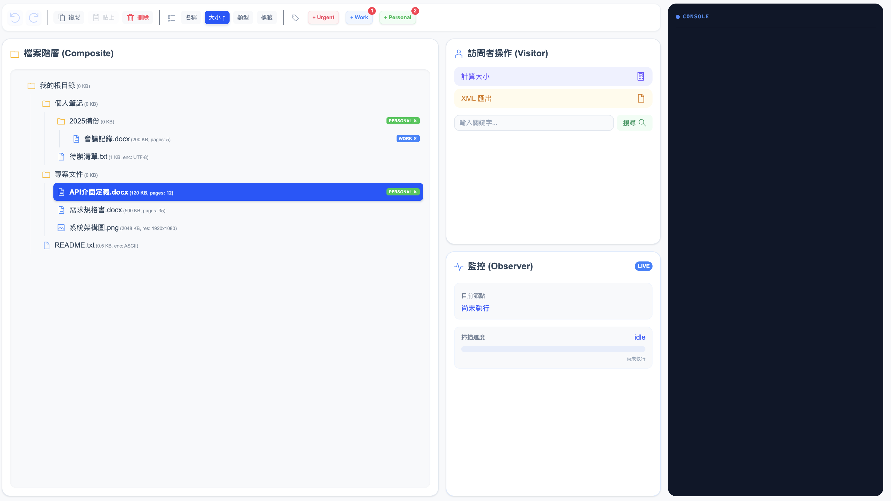
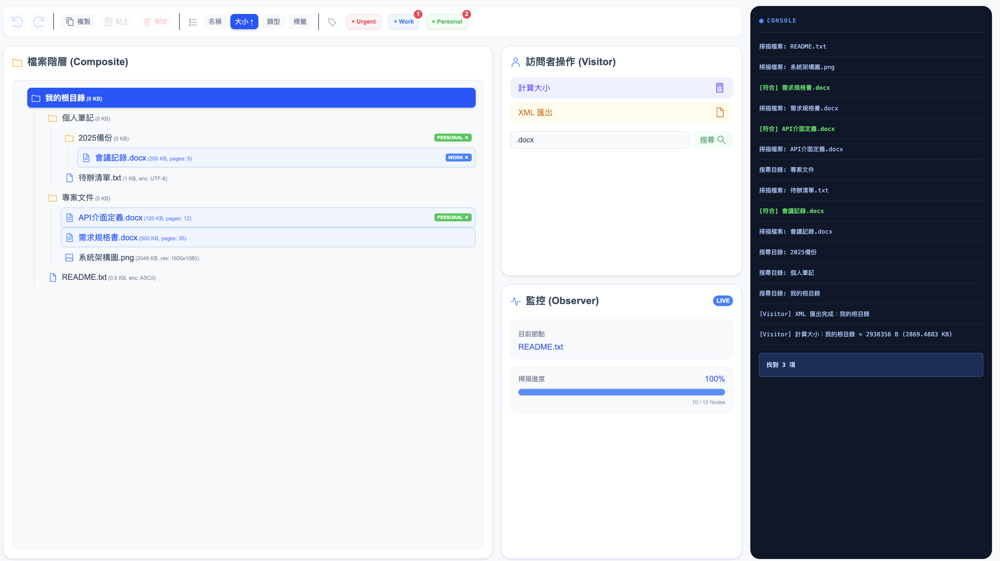
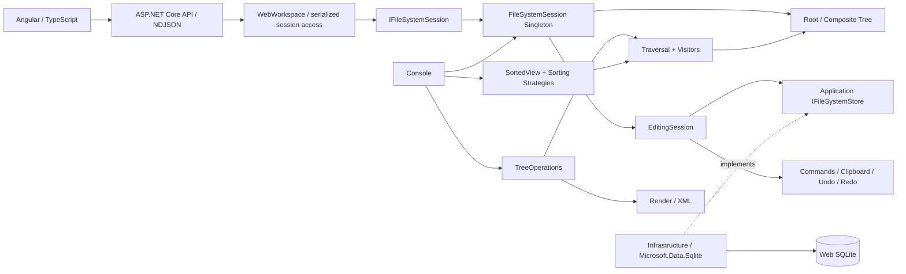
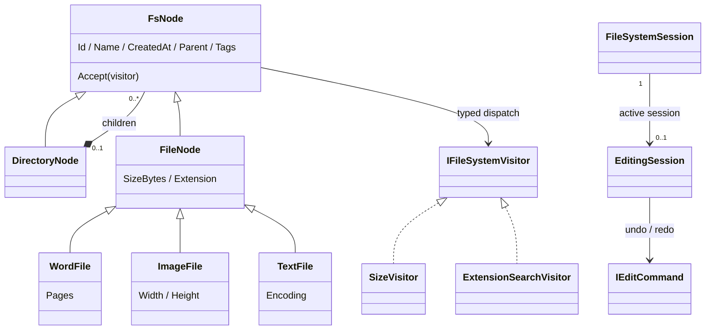
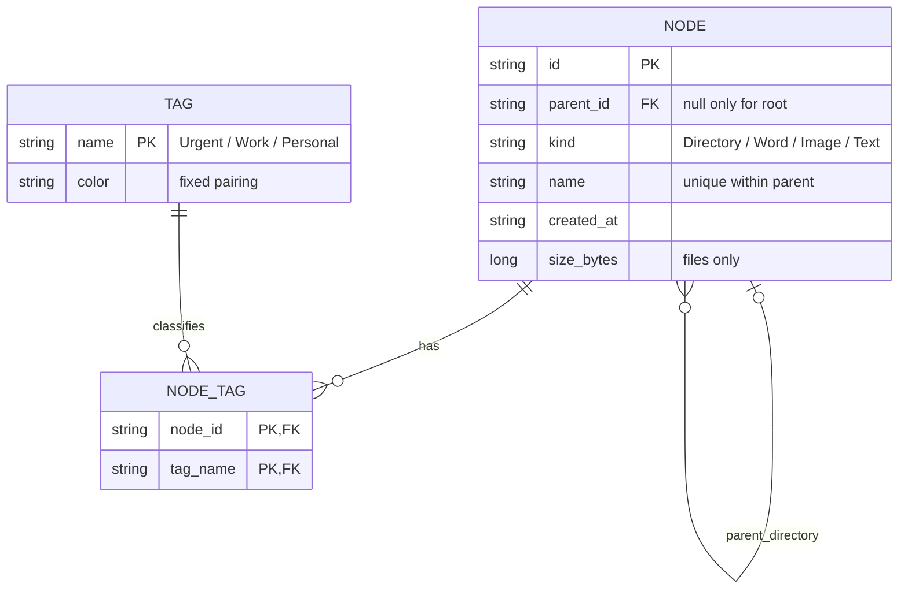

# CloudFileManager

## 1. Project Overview

以 **Angular + TypeScript / ASP.NET Core / .NET 10** 實作的雲端檔案管理系統，提供樹狀檔案瀏覽、搜尋與排序、可復原的編輯操作及 XML Export，並結合七種 Design Patterns 與可追溯的 AI Agent 開發流程。

目前提供互動式 Web UI 與 Console，完成 mandatory requirements 與 Bonus。Angular 僅管理畫面，ASP.NET Core API 與 C# Core 是唯一 domain authority。Web 以 SQLite 保存 filesystem metadata 與樹狀結構；Console 保留固定的 in-memory 示範。沒有真實雲端上傳或檔案內容讀寫。目前已完成 Core 分層（[TASK-007](spaces/core-layering-refactor/status.md)）與 xUnit migration（[TASK-008](spaces/xunit-test-migration/status.md)），Angular migration 紀錄見 [TASK-006](spaces/angular-frontend-migration/status.md)。TASK-009 保留取消實作的探索歷史；TASK-010 是新的 session dependency injection 演進，保留 classic GoF Singleton，詳見[演進](#11-architecture-evolution)。

快速閱讀：[Demo](#2-demo) → [架構](#4-architecture-overview) → [七種 Patterns](#7-design-patterns) → [開發學習](#10-development-insights--learning) → [演進](#11-architecture-evolution) → [執行](#12-build--run)／[驗證](#13-testing--verification)

## 2. Demo

### File Manager



支援檔案與目錄瀏覽、排序、Tags、Copy / Paste、Delete 與 Undo / Redo

### Search & Traversal Progress



針對選取目錄進行副檔名搜尋與子樹容量計算，透過 Observer 顯示真實 traversal 進度與訪問紀錄，亦支援選取子樹（selected subtree）的 XML 匯出與下載。

## 3. Assignment Requirements & Implemented Features

| 作業要求 | 實作與驗證入口 |
|---|---|
| Domain Model / UML、ER Model | 下方目前模型、[詳細 Domain Model](spaces/visitor-singleton-enhancement/sa/domain-model.md)、[ER](spaces/visitor-singleton-enhancement/sa/er-model.md) |
| 檔案與目錄、型別 metadata | [Nodes](src/CloudFileManager.Core/Domain/Nodes/Nodes.cs)：名稱、建立時間、大小，Word 頁數、Image 寬高、Text 編碼，檔案必須屬於目錄 |
| 指定範例樹與詳細資訊 | [SampleTree](src/CloudFileManager.Core/Application/Samples/SampleTree.cs)、Console 預設輸出：4 個目錄、5 個檔案 |
| 任意目錄的完整子樹容量 | `TreeOperations.CalculateTotalSize`：空目錄為零，checked long 防止溢位 |
| 副檔名搜尋 | `TreeOperations.SearchByExtension`：包含子目錄與完整路徑，接受有／無點號與大小寫變化 |
| XML 結構與內容 | `TreeOperations.ToXml`：名稱合法化、碰撞處理與 escaping，[原題 XML fixture](tests/CloudFileManager.Tests/Fixtures/expected.xml) |
| 演算法訪問紀錄 | 容量與搜尋依 DFS 印出 `Visiting:`，每節點一次，[Core xUnit tests](tests/CloudFileManager.Tests/Application/AssignmentRegressionTests.cs) 核對順序與結果 |

容量採二進位：**1 KB = 1024 B、1 MB = 1024 KB**，內部保存整數 bytes。測試從原始五筆資料獨立換算，產品不硬編碼總容量。遍歷以明確 stack 處理深層樹，避免遞迴呼叫堆疊限制。建立時間為固定示範值。XML 是題目展示格式，不是可逆保存協定。

## 4. Architecture Overview



- **Domain**：Node 控制結構與 ownership，外部不可任意設定 Parent 或修改 Children 集合
- **Operations**：Traversal 管 DFS 與 logging，Visitor 管容量／搜尋／XML，Strategy 管排序鍵與方向，Command 管編輯及復原
- **Lifecycle**：`FileSystemSession` 持有 Root 與私有 `EditingSession`。`Reset(newRoot)` 替換 Root、清空 Clipboard／Undo／Redo，不屬於 Command、不可 Undo，非法 Root 保留原狀態

**Single-threaded application session**：Root、Clipboard、Command History、Reset 不承諾 thread-safe，Core 本身不加入 locking。WebWorkspace 在 API boundary 序列化 session 存取。Singleton 唯一性不等於 thread safety。首次使用由 composition root 初始化：Console 呼叫 Reset，Web 呼叫 Restore 載入已驗證的 durable tree。外部 Add* 應在建立 session 前完成，之後直接改樹會觸發既有 revision 過期檢查。

Core 保留單一 `.csproj`，以 `CloudFileManager.Core.Domain.*` 與 `CloudFileManager.Core.Application.*` 建立責任邊界：Application → Domain，Domain 不依賴 Application、Infrastructure 或 SQLite。Domain 保存 Nodes、值、Prototype 與純查詢 Visitors，Application 負責 sessions/history/commands、排序、traversal/progress、XML、formatting/rendering 與 bootstrap samples。這是 namespace 分層，不是 assembly 隔離。現有 ArchitectureTests 另以 compiled metadata／IL 檢查依賴方向與 mutation caller 白名單，包含負向案例。

`FsNode.Details` 與 `BinarySize.Format` 已搬至 Application 的 `NodeDetailsFormatter.Format(node)`／`BinarySizeFormatter.Format(bytes)`，既有輸出格式保持不變。`TreeOperations` 是薄入口，委派 Queries／Rendering／Export，原 Console 預設 logging 保留。詳見 [TASK-007 設計](spaces/core-layering-refactor/sa/design.md)。

## 5. Domain Model / UML



只有 Root 的 Parent 為 null，其他目錄與所有檔案均有一個父目錄。Delete 移出活樹，但 Command 保留原節點及位置供 Undo，Paste 建立獨立新 ID 與父子關係，不把原節點掛到兩處。

目前 session injection 見 [TASK-010 設計](spaces/session-lifecycle-di-implementation/sa/design.md)，Web persistence bootstrap 與生命週期見 [TASK-011 設計](spaces/sqlite-persistence-architecture/sa/design.md)；最初 Singleton 模型保留於 [TASK-003 Domain Model](spaces/visitor-singleton-enhancement/sa/domain-model.md)。

## 6. ER Model



上圖為閱讀摘要。完整欄位與約束見 [schema.sql](schema.sql)、[schema-tags.sql](schema-tags.sql)、[詳細 ER](spaces/visitor-singleton-enhancement/sa/er-model.md)：TPH 映射繼承、父節點必須是 Directory、至多一個 Root、型別 metadata CHECK、同層名稱唯一、Tag 關聯不可重複。頁數、解析度、編碼與 XmlAlias 依型別限制。

根目錄 SQLite schema 保留原題 ER 驗證；Web 使用 [versioned production schema](src/CloudFileManager.Infrastructure/Schema/v1.sql)，另存 sibling ordering、schema version、durable revision 與 commit receipt。Clipboard、History 與 UI/session state 不持久化。

## 7. Design Patterns

| Pattern | Concrete problem / 為何適合 | Implementation / 使用位置 | Trade-off |
|---|---|---|---|
| **Composite** | 目錄與三種檔案需要同一套樹狀訪問及子樹操作，共同節點型別避免呼叫端重建拓撲 | [FsNode / DirectoryNode / FileNode](src/CloudFileManager.Core/Domain/Nodes/Nodes.cs)，範例樹、遍歷、編輯皆使用 | 必須維護父子 ownership，不開放任意 reparent |
| **Strategy** | 執行時切換名稱、大小、副檔名、標籤排序，分開鍵計算與顯示順序 | [INodeSortStrategy、Name/Size/Extension/TagSortStrategy、SortedView](src/CloudFileManager.Core/Application/Sorting/Sorting.cs)，Bonus 排序 | 比單一 switch 多介面與類別，但可獨立測試／替換策略 |
| **Command** | Delete、Paste、Tag 加減須各自保留復原資訊，並共用線性歷史 | [IEditCommand、DeleteCommand、PasteCommand、TagCommand、EditingSession](src/CloudFileManager.Core/Application/Sessions/EditingSession.cs)，Bonus 編輯與 Undo/Redo | 保存節點、快照及歷史占用記憶體，操作須維持成功／失敗一致性 |
| **Visitor** | 在穩定 Node types 上分離容量、搜尋與 XML operations，新增 operation 不需把演算法塞入 Node | [IFileSystemVisitor、SizeVisitor、ExtensionSearchVisitor、FileSystemTraversal](src/CloudFileManager.Core/Domain/Visiting/QueryVisitors.cs)，TreeOperations、XML 匯出與大小排序，XmlExportVisitor | 新增 Node type 須更新 visitor 介面及實作，每次操作建立新 accumulator |
| **Singleton** | 明確需要 application-wide Root、Clipboard 與 History context，集中初始化／Reset | [FileSystemSession.Instance](src/CloudFileManager.Core/Application/Sessions/FileSystemSession.cs)，composition root 提供既有 Instance，BonusDemo／WebWorkspace 透過 IFileSystemSession 使用，委派 EditingSession | 全域 mutable state 需測試隔離且不 thread-safe，GoF 控制唯一實體；DI singleton lifetime 控制同一 provider 的解析重用，此處提供既有 Instance，不建立另一個 session；Web API 存取序列化 |
| **Observer** | UI 需要接收真實 traversal 進度，而不讓 Visitor 依賴畫面 | TraversalProgressSource.Progressed → WebWorkspace → NDJSON → Angular ObserverPanel | 每次 operation 訂閱並釋放，進度不是 timer 模擬 |
| **Prototype** | Copy 當下保存完整獨立快照，來源後續修改不得影響 Paste | INodePrototype / NodeSnapshot → EditingSession Copy／Paste | 完整子樹快照占記憶體，貼上仍由 Command 維護原子性與 history |

**Production paths**：容量／搜尋由 [Program](src/CloudFileManager.Console/Program.cs) → [TreeOperations](src/CloudFileManager.Core/Application/TreeOperations.cs) → Traversal → `Accept` → typed Visitor，[BonusDemo](src/CloudFileManager.Console/BonusDemo.cs) 編輯透過注入的 `IFileSystemSession`（由 Console Program 提供 `FileSystemSession.Instance`）共用 Clipboard 與 History。兩者都不是只有 class 或 test。

Visitor 不接管所有操作：Render 保持原責任。TASK-004 加入 XmlExportVisitor，集中 XML traversal／serialization state 並保持原 contract。替代方案與取捨見 [TASK-002 設計](spaces/design-pattern-enhancement/sa/design.md)／[TASK-003 ADR](spaces/visitor-singleton-enhancement/sa/design.md)。

## 8. Bonus Features

| 功能 | 已實作行為 |
|---|---|
| Sorting | Directory 永遠優先，各組按 Name／Size／Extension／Tag 升降冪。文字忽略大小寫、同鍵穩定、不加次排序，目錄大小取完整 subtree、Extension 空值。只改 view，不改 Children／traversal／XML |
| Delete | 可刪整棵非空子樹、保護 Root，Undo 回復原位置、ID、metadata、Tags |
| Copy / Paste | Copy 當下完整快照，來源後續變動／刪除不影響 Paste。新副本獨立，同名採 Ordinal 拒絕，不改名、不覆蓋、不留部分變更 |
| Tags | 檔案與目錄可同時有 Urgent 紅、Work 藍、Personal 綠，Console 顯示名稱與顏色，不改 XML |
| Undo / Redo | 僅成功且實際改變 domain 的新操作建立 entry 並清 Redo，失敗、no-op、Copy、Sorting 不影響歷史 |

`--bonus` 是可重現的 Console 示範，非互動式檔案瀏覽器，底層 API 可由呼叫端選取節點並操作。

## 9. AI Agent Development Workflow

`Human Request → PM → Grill Me → SA → Grill Me → DEV → Grill Me → TEST → Grill Me`

各角色在工作中與交接前，以專案版 **Grill Me** 挑戰需求、設計、實作與驗證假設。同一 agent 依序切換角色，不宣稱四個獨立 agents 審查。

- **Gate**：PASS 才交接，REVISE 退回適當角色，BLOCK 等待必要答覆／條件。現有紀錄的對應名稱為 `PASS / REWORK / BLOCKED`
- **Human-in-the-loop**：影響驗收的問題標 OPEN 等待 Human，區分 USER_CONFIRMED、SOURCE、ROLE_DECISION、AI_PROPOSAL，不把提案當答案
- **Persistent Markdown artifacts**：每個 `spaces/<task>/` 保留 request、requirements、design、grill-me、handoff、status、timeline、test report、summary
- **失敗不覆寫**：保存失敗 evidence、REWORK 原因、責任角色、修正及重驗輪次，目前狀態以各 task 的 status 為準

先讀[架構演進](#11-architecture-evolution)中的各任務 summary，再看 [workflow 說明](docs/workflow.md)、[sdlc-workflow Skill](.agents/skills/sdlc-workflow/SKILL.md)、[grill-me Skill](.agents/skills/grill-me/SKILL.md)，完整 evidence 在 [spaces](spaces/)。Grill Me 為本專案自訂版本，不宣稱第三方同名原版。

真實回退案例：[TASK-001 SQLite 相容性修正](spaces/cloud-file-manager/test/defects.md)、[TASK-002 驗證脚本格式誤判及重驗](spaces/design-pattern-enhancement/test/defects.md)

## 10. Development Insights & Learning

### Core Layering

Core 同時承擔模型規則與應用流程，責任邊界不易辨識，因此在單一 project 內整理 Domain／Application namespaces，並加入 Architecture Tests 檢查依賴方向。這次調整讓我理解，分層的重點是責任與依賴約束，而不只是資料夾或 assembly 數量。

### Design Patterns

樹狀結構、可切換排序與可復原編輯各有不同需求，因此分別以 Composite、Strategy、Command 處理。application-wide session 與 traversal 需求明確後，再導入 Visitor 與 classic GoF Singleton，後續以 Observer、Prototype 支援進度通知與複製快照。這讓我理解 Pattern 應對應具體問題，也必須說明取捨，而不是只累積數量。

### Testing & Refactoring

自製 C# runners 不易整合標準測試流程，因此將四個測試專案遷移至 xUnit，保留既有 assertions、負例與邊界案例，透過 `dotnet test` 執行。Core 分層與測試遷移的 regression 驗證讓我理解，重構不只要調整結構，也要有證據確認既有行為未變。

### AI-assisted Development

AI 產出的方案仍需要釐清需求與驗證，因此採用 PM → SA → DEV → TEST 流程，搭配 Grill Me 與 Human Gate，保留提案、修正及驗證紀錄。TASK-009 的 DI/session lifecycle 探索當時由 Human Gate 決定不實作，讓我理解 AI 能協助分析，但實作範圍與架構選擇仍須由開發者理解並決定。

## 11. Architecture Evolution

| Task / Evidence | 當時需求與決策 | 建議閱讀 |
|---|---|---|
| [TASK-001](spaces/cloud-file-manager/) | Mandatory assignment + Composite，建立樹、容量／搜尋／XML／logging | [Summary](spaces/cloud-file-manager/summary.md)／[需求](spaces/cloud-file-manager/pm/requirements.md) |
| [TASK-002](spaces/design-pattern-enhancement/) | Bonus + Strategy + Command，SA 當時評估後**拒絕 Visitor／Singleton**，避免無需求的架構成本 | [Summary](spaces/design-pattern-enhancement/summary.md)／[設計](spaces/design-pattern-enhancement/sa/design.md) |
| [TASK-003](spaces/visitor-singleton-enhancement/) | application-wide session 與 traversal operations 需求明確後，重新評估先前決策，透過完整 workflow 導入 Visitor + Singleton | [Summary](spaces/visitor-singleton-enhancement/summary.md)／[ADR](spaces/visitor-singleton-enhancement/sa/design.md)／[Final Gate](spaces/visitor-singleton-enhancement/test/grill-me.md) |
| [TASK-004](spaces/reference-ui-replication/) | Web UI + Observer + Prototype，功能、XML、Reference B 通過，但 Reference A D005 尺寸不符，retry 3/3 exhausted → **FAILED** | [Status](spaces/reference-ui-replication/status.md) |
| [TASK-005](spaces/reference-ui-visual-recovery/) | D005 corrective task，只修 style.css，Reference A/B 通過 → **DONE / PASS**，不回寫 TASK-004 | [Summary](spaces/reference-ui-visual-recovery/summary.md) |
| [TASK-006](spaces/angular-frontend-migration/) | 將已驗收 presentation layer 遷移為 Angular + TypeScript，保留 C# API/Core 與七種 Patterns | [Status](spaces/angular-frontend-migration/status.md)／[SA](spaces/angular-frontend-migration/sa/design.md) |
| [TASK-007](spaces/core-layering-refactor/) | 為釐清 Core responsibilities，在單一 project 整理 Domain／Application 邊界，加入 Architecture Tests 約束依賴方向，保留七 Patterns 及產品行為 | [Status](spaces/core-layering-refactor/status.md)／[設計](spaces/core-layering-refactor/sa/design.md) |
| [TASK-008](spaces/xunit-test-migration/) | 為整合標準 `dotnet test` 流程，將四個 custom C# runners 遷移至 xUnit，保留 72 cases 的 assertions、負例與邊界覆蓋，以及非 C# 驗證責任，不改 production | [Status](spaces/xunit-test-migration/status.md)／[coverage mapping](spaces/xunit-test-migration/sa/migration-map.md) |
| [TASK-009](spaces/session-lifecycle-di-refactor/) | **CANCELLED / NOT IMPLEMENTED — Human scope decision, not technical failure**。完成 DI/session lifecycle architecture exploration 後，Human Gate 決定本版不實作。未進 DEV，未執行實作驗證，既有 classic GoF Singleton 保持不變 | [Status](spaces/session-lifecycle-di-refactor/status.md)／[SA handoff 與結案](spaces/session-lifecycle-di-refactor/sa/handoff.md) |
| [TASK-010](spaces/session-lifecycle-di-implementation/) | **DONE / PASS**：保留 GoF Singleton，Application contract 注入，bootstrap 管理 Reset；consumer isolation 不等於 production 多 session | [Status](spaces/session-lifecycle-di-implementation/status.md)／[設計](spaces/session-lifecycle-di-implementation/sa/design.md) |
| [TASK-011](spaces/sqlite-persistence-architecture/) | Web-only SQLite：完整 durable tree transaction、stable-ID hydration、失敗補償與 fail-closed；Console 不變 | [Status](spaces/sqlite-persistence-architecture/status.md)／[設計](spaces/sqlite-persistence-architecture/sa/design.md) |

舊決策與當時的「未 commit」等狀態是歷史快照，不回寫成現在的結果。`spaces/` 保留各次任務原貌，[根目錄 VALIDATION](VALIDATION.md)／[初始套件驗證](docs/VALIDATION.md) 屬早期記錄，**各任務結果以自己的 status／test report 為準。Angular migration 見 TASK-006，Core 分層見 TASK-007，xUnit migration 見 TASK-008；目前 dependency boundary 見 TASK-010，SQLite persistence 與最新 regression 驗證見 TASK-011。TASK-009 仍為取消實作的架構探索**。

## 12. Build / Run

需要 **.NET 10 SDK**（已驗證 10.0.401），Python **3.9+** 含標準庫 SQLite，用於 schema／完整驗證。Core／Console 沒有外部 NuGet 套件；Web 的 Infrastructure 使用 Microsoft.Data.Sqlite 10.0.12。xUnit 測試專案使用 xunit.v3、xunit.runner.visualstudio 與 Microsoft.NET.Test.Sdk，首次 build/test 需要還原 NuGet dependencies。Web frontend 使用 Node 24.21.0（或 Angular 22 支援的 Node 版本）、Angular 22.2.0、TypeScript 6.0.3，npm lockfile 固定依賴。在 repository 根目錄執行：

```sh
dotnet build CloudFileManager.slnx -c Release
dotnet run --project src/CloudFileManager.Console -c Release --no-build
dotnet run --project src/CloudFileManager.Console -c Release --no-build -- --xml
dotnet run --project src/CloudFileManager.Console -c Release --no-build -- --bonus
```

依序為 build、mandatory 功能與訪問紀錄、純 XML、Bonus 示範。執行僅操作記憶體模型，不對本機真實檔案做 Delete／Paste。

### Angular Web UI

```sh
cd src/CloudFileManager.Angular
npm ci
npm run build
cd ../..
dotnet build CloudFileManager.slnx -c Release
dotnet run --project src/CloudFileManager.Web -c Release --no-build -- --urls http://localhost:5080
```

開啟 http://localhost:5080 。**先 build Angular**：輸出到 ignored `Web/wwwroot`，由 ASP.NET Core 同 origin 提供，單獨 dotnet build 不會產生 frontend。開發時可另在 Angular 目錄 `npm start`（proxy `/api` 到 5080）。

UI 有排序、選取、Tags、Copy/Paste、Delete、Undo/Redo、selected subtree 容量／extension search／XML download。Observer 由真實 traversal events 更新。Refresh 重新取得 server session，不重置樹或歷史，重新啟動 server 載入已保存的樹，並清空 Clipboard／History／畫面 runtime state；只有尚未初始化的資料庫才建立 sample。多個瀏覽器共用同一 application session，不提供使用者隔離。

Web 預設資料庫為 `src/CloudFileManager.Web/App_Data/filesystem.db`（ignored）。可用環境變數 `FileSystem__DatabasePath` 或啟動參數 `--FileSystem:DatabasePath /path/to/filesystem.db` 指定位置。每個 DB 僅支援一個 Web application owner；Console 不讀寫此 DB。

每次成功的 Delete／Paste／Tag／Undo／Redo 都在回報成功前完成 durable-tree transaction。確認 rollback 時保留操作前的樹、Clipboard 與完整 history；commit outcome 不明時 session unavailable，需處理原因並重啟，不會清除 history 後假裝成功。無效／不支援版本的 DB 拒絕啟動，不自動覆寫。SQLite 不保存 UI selection、progress、logs 或 Undo／Redo history。

## 13. Testing & Verification

C# 測試使用 **xUnit v3**，標準入口為 repository root 的 `dotnet test`。五個 projects 共 **127 cases**：Core 14、Bonus 20、Architecture 18（既有 12＋TASK-007 layer checks 6）、Web 46（原 20 案例在 Singleton／isolated 兩種模式執行，加 6 項 dependency/composition checks）、Persistence 29（真實 temporary SQLite 與 failure／restart coverage）。Python schema 12＋Tag schema 6 與 Angular NDJSON 8 項保留原工具，各框架結果分開報告。C# 結果不代表 browser／visual 驗證。

TASK-011 本輪結果：C# / xUnit **127/127**（保留既有 98，新增 Persistence 29，含 Core layering Architecture **6/6**）、Python schema **18/18**、Angular **8/8**。Release Rebuild、Console／Web smoke、真實 XML download、Reference A／B、Web SQLite restart 各自 **PASS**。失敗嘗試與 REWORK 均保留於各任務 evidence。

[TASK-008 coverage mapping](spaces/xunit-test-migration/sa/migration-map.md) 保留 legacy ID、原 assertions／負例／邊界，[TASK-011 最新報告](spaces/sqlite-persistence-architecture/test/test-report.md) 提供本輪命令、exit codes 與 evidence。歷史 TASK-006／007 PASS 不代替本輪驗證。

```sh
cd src/CloudFileManager.Angular
npm test
npm run build
cd ../..
dotnet build CloudFileManager.slnx -c Release -t:Rebuild
dotnet test CloudFileManager.slnx -c Release --no-build
python3 tests/verify_schema.py
python3 tests/verify_tag_schema.py
```

Visual acceptance 使用 [Reference A](docs/reference-ui.png) 2914×948 與 [Reference B](docs/reference-ui-search-progress.png) 2028×682。Search match highlight 與 selection 分離，進度／日誌不得預填。XML 必須實際由瀏覽器下載。自動 suites 不能取代 visual／download review。

每個 C# case 可由 xUnit 個別 discovery／執行，failure 由 `dotnet test` 非零 exit code 回報。五個 test assemblies 內採序列執行，真實 Singleton cases 每案 Reset；isolated consumer cases 與純 Visitor cases 不使用全域 Reset，A01 冷啟動以 test-only child process 觀察，沒有 production test hook。可用 `dotnet test tests/CloudFileManager.ArchitectureTests --filter LegacyId=A01` 單獨驗證，或加入 `--logger trx --results-directory /tmp/cloud-file-manager-test-results` 保存標準報告。Web tests 直接驗證 WebWorkspace，真正 HTTP、XML download 與 Reference A/B 另行驗證。

舊 TASK runner 保留作為 baseline-bound 歷史工具，不應對目前版本執行或寫回已完成任務。目前驗證入口與 evidence 位於 `spaces/sqlite-persistence-architecture/test/`，Python schema scripts 仍是現行獨立檢查。

## 14. Repository Structure

```text
CloudFileManager.slnx
src/
  CloudFileManager.Core/              # 單一 project
    Domain/                          # Nodes / Values / Visiting / Prototypes
    Application/                     # Sessions / Persistence port / Commands / Sorting / Traversal / Export / Formatting
  CloudFileManager.Infrastructure/    # Web SQLite / versioned schema / aggregate store
  CloudFileManager.Angular/           # Typed components / presentation store / stream parser
  CloudFileManager.Web/               # API / server session projection / generated wwwroot
  CloudFileManager.Console/           # Mandatory / XML / Bonus 入口
tests/
  CloudFileManager.Tests/             # Core 14；原題資料與 XML fixtures
  CloudFileManager.BonusTests/        # Bonus 20
  CloudFileManager.ArchitectureTests/ # Visitor / Singleton 12 + Core layering checks 6
  CloudFileManager.PersistenceTests/  # 29 persistence / rollback / restart cases
  verify_schema.py                   # Schema 12
  verify_tag_schema.py                # Tag schema 6
  CloudFileManager.WebTests/          # Web dual-mode 40 + dependency/composition 6
schema.sql / schema-tags.sql          # 可執行 ER 約束
.agents/skills/                       # sdlc-workflow / grill-me
docs/                                # Workflow 教學、初始驗證記錄
examples/                            # 標明未執行的 Grill Me 格式範例
spaces/
  cloud-file-manager/                # TASK-001 歷史
  design-pattern-enhancement/         # TASK-002 歷史
  visitor-singleton-enhancement/      # TASK-003 歷史
  reference-ui-replication/           # TASK-004 FAILED（保留）
  reference-ui-visual-recovery/        # TASK-005 corrective PASS
  angular-frontend-migration/          # TASK-006
  core-layering-refactor/              # TASK-007
  xunit-test-migration/                # TASK-008
  session-lifecycle-di-refactor/       # TASK-009 CANCELLED / NOT IMPLEMENTED
  session-lifecycle-di-implementation/ # TASK-010
  sqlite-persistence-architecture/     # TASK-011
```

程式／solution 使用 **CloudFileManager**，GitHub repository 名稱為 **CloudFileManager**。Build outputs、local IDE files 與 `.env` 設定由 `.gitignore` 排除，skills 與 workflow artifacts 保留在版本控制中。

TASK-010 的 WebWorkspace 不自行取得 Singleton 或 Reset；Web Program 以 DI factory 提供既有 Instance，Console Program 顯式傳入。GoF 控制唯一實體，DI lifetime 控制解析重用，兩者不同。Production 仍單 host/process、共享 session 且由 Web Gate 序列化；不同 provider 不代表獨立 session。Test-only adapter 只委派真實 EditingSession，A01 cold-start 與實際 Singleton lifecycle tests 保留。
