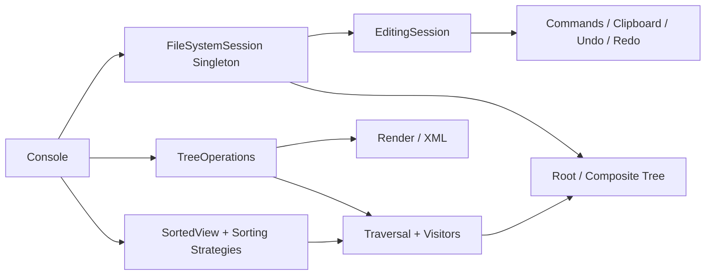
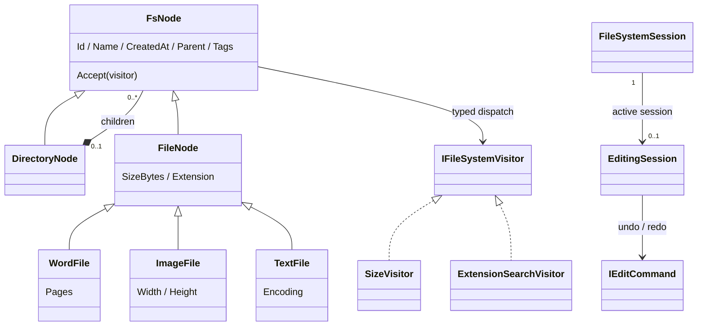
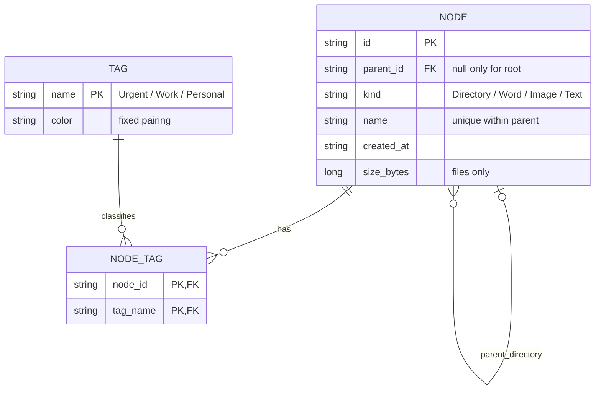

# CloudFileManager

## 1. Project Overview

以 **C# / .NET 10 Console** 實作的雲端檔案管理領域模型作業，展示樹狀模型、可復原的編輯操作、五種 Design Patterns，以及可追溯的 AI Agent 開發過程。

目前完成 mandatory requirements 與全部 Bonus；TASK-003 最終驗證為 **64/64 tests、Release Rebuild PASS、Console smoke PASS**。這是記憶體中的檔案模型，沒有實際雲端上傳、檔案內容讀寫、GUI 或資料庫存取；Console 重現執行結果，Core API 可供其他介面使用。

快速閱讀：[架構](#3-architecture-overview) → [五種 Patterns](#6-design-patterns) → [演進](#9-architecture-evolution) → [執行](#10-build--run)／[驗證](#11-testing--verification)。

## 2. Assignment Requirements & Implemented Features

| 作業要求 | 實作與驗證入口 |
|---|---|
| Domain Model / UML、ER Model | 下方目前模型、[詳細 Domain Model](spaces/visitor-singleton-enhancement/sa/domain-model.md)、[ER](spaces/visitor-singleton-enhancement/sa/er-model.md) |
| 檔案與目錄、型別 metadata | [Nodes](src/CloudFileManager.Core/Nodes.cs)：名稱、建立時間、大小；Word 頁數、Image 寬高、Text 編碼；檔案必須屬於目錄 |
| 指定範例樹與詳細資訊 | [SampleTree](src/CloudFileManager.Core/SampleTree.cs)、Console 預設輸出：4 個目錄、5 個檔案 |
| 任意目錄的完整子樹容量 | `TreeOperations.CalculateTotalSize`；空目錄為零，checked long 防止溢位 |
| 副檔名搜尋 | `TreeOperations.SearchByExtension`；包含子目錄與完整路徑，接受有／無點號與大小寫變化 |
| XML 結構與內容 | `TreeOperations.ToXml`；名稱合法化、碰撞處理與 escaping；[原題 XML fixture](tests/CloudFileManager.Tests/Fixtures/expected.xml) |
| 演算法訪問紀錄 | 容量與搜尋依 DFS 印出 `Visiting:`，每節點一次；[Core tests](tests/CloudFileManager.Tests/Program.cs) 核對順序與結果 |

容量採二進位：**1 KB = 1024 B、1 MB = 1024 KB**，內部保存整數 bytes。測試從原始五筆資料獨立換算，產品不硬編碼總容量。遍歷以明確 stack 處理深層樹，避免遞迴呼叫堆疊限制。建立時間為固定示範值；XML 是題目展示格式，不是可逆保存協定。

## 3. Architecture Overview



- **Domain**：Node 控制結構與 ownership；外部不可任意設定 Parent 或修改 Children 集合。
- **Operations**：Traversal 管 DFS 與 logging；Visitor 管容量／搜尋；Strategy 管排序鍵與方向；Command 管編輯及復原。
- **Lifecycle**：`FileSystemSession` 持有 Root 與私有 `EditingSession`。`Reset(newRoot)` 替換 Root、清空 Clipboard／Undo／Redo，不屬於 Command、不可 Undo；非法 Root 保留原狀態。

**Single-threaded application session**：Root、Clipboard、Command History、Reset 不承諾 thread-safe，也沒有加入 locking。Singleton 唯一性不等於 thread safety。首次使用須 Reset 初始化；外部 Add* 應在建立 session 前完成，之後直接改樹會觸發既有 revision 過期檢查。

## 4. Domain Model / UML



只有 Root 的 Parent 為 null；其他目錄與所有檔案均有一個父目錄。Delete 移出活樹，但 Command 保留原節點及位置供 Undo；Paste 建立獨立新 ID 與父子關係，不把原節點掛到兩處。

完整 runtime composition 與生命週期限制見 [TASK-003 Domain Model](spaces/visitor-singleton-enhancement/sa/domain-model.md)／[架構決策](spaces/visitor-singleton-enhancement/sa/design.md)。

## 5. ER Model



上圖為閱讀摘要。完整欄位與約束見 [schema.sql](schema.sql)、[schema-tags.sql](schema-tags.sql)、[詳細 ER](spaces/visitor-singleton-enhancement/sa/er-model.md)：TPH 映射繼承、父節點必須是 Directory、至多一個 Root、型別 metadata CHECK、同層名稱唯一、Tag 關聯不可重複。頁數、解析度、編碼與 XmlAlias 依型別限制。

SQLite schema 用於驗證 ER，應用仍是記憶體模型。Clipboard、History 與 Singleton context 不持久化，也不新增 session 資料表。

## 6. Design Patterns

| Pattern | Concrete problem / 為何適合 | Implementation / 使用位置 | Trade-off |
|---|---|---|---|
| **Composite** | 目錄與三種檔案需要同一套樹狀訪問及子樹操作；共同節點型別避免呼叫端重建拓撲 | [FsNode / DirectoryNode / FileNode](src/CloudFileManager.Core/Nodes.cs)；範例樹、遍歷、編輯皆使用 | 必須維護父子 ownership；不開放任意 reparent |
| **Strategy** | 執行時切換名稱、大小、副檔名排序；分開鍵計算與顯示順序 | [INodeSortStrategy、Name/Size/ExtensionSortStrategy、SortedView](src/CloudFileManager.Core/Sorting.cs)；Bonus 排序 | 比單一 switch 多介面與類別，但可獨立測試／替換策略 |
| **Command** | Delete、Paste、Tag 加減須各自保留復原資訊，並共用線性歷史 | [IEditCommand、DeleteCommand、PasteCommand、TagCommand、EditingSession](src/CloudFileManager.Core/EditingSession.cs)；Bonus 編輯與 Undo/Redo | 保存節點、快照及歷史占用記憶體；操作須維持成功／失敗一致性 |
| **Visitor** | 在穩定 Node types 上分離容量與搜尋 operations；新增 operation 不需把演算法塞入 Node | [IFileSystemVisitor、SizeVisitor、ExtensionSearchVisitor、FileSystemTraversal](src/CloudFileManager.Core/Visitors.cs)；TreeOperations 與大小排序 | 新增 Node type 須更新 visitor 介面及實作；每次操作建立新 accumulator |
| **Singleton** | 明確需要 application-wide Root、Clipboard 與 History context；集中初始化／Reset | [FileSystemSession.Instance](src/CloudFileManager.Core/FileSystemSession.cs)；Program 與 BonusDemo 實際使用，委派 EditingSession | 全域 mutable state 需測試隔離且不 thread-safe；DI singleton 可由容器管理生命週期，目前 Console 沒有 DI host |

**Production paths**：容量／搜尋由 [Program](src/CloudFileManager.Console/Program.cs) → [TreeOperations](src/CloudFileManager.Core/TreeOperations.cs) → Traversal → `Accept` → typed Visitor；[BonusDemo](src/CloudFileManager.Console/BonusDemo.cs) 編輯透過 `FileSystemSession.Instance` 共用 Clipboard 與 History。兩者都不是只有 class 或 test。

Visitor 沒有機械式接管所有操作：Render／XML 保留原演算法，避免把開始／結束標籤及同層命名狀態硬塞入單節點 visitor。替代方案與取捨見 [TASK-002 設計](spaces/design-pattern-enhancement/sa/design.md)／[TASK-003 ADR](spaces/visitor-singleton-enhancement/sa/design.md)。

## 7. Bonus Features

| 功能 | 已實作行為 |
|---|---|
| Sorting | Directory 永遠優先；各組按 Name／Size／Extension 升降冪。文字忽略大小寫、同鍵穩定、不加次排序；目錄大小取完整 subtree、Extension 空值。只改 view，不改 Children／traversal／XML |
| Delete | 可刪整棵非空子樹、保護 Root；Undo 回復原位置、ID、metadata、Tags |
| Copy / Paste | Copy 當下完整快照；來源後續變動／刪除不影響 Paste。新副本獨立；同名採 Ordinal 拒絕，不改名、不覆蓋、不留部分變更 |
| Tags | 檔案與目錄可同時有 Urgent 紅、Work 藍、Personal 綠；Console 顯示名稱與顏色，不改 XML |
| Undo / Redo | 僅成功且實際改變 domain 的新操作建立 entry 並清 Redo；失敗、no-op、Copy、Sorting 不影響歷史 |

`--bonus` 是可重現的 Console 示範，非互動式檔案瀏覽器；底層 API 可由呼叫端選取節點並操作。

## 8. AI Agent Development Workflow

`Human Request → PM → Grill Me → SA → Grill Me → DEV → Grill Me → TEST → Grill Me`

各角色在工作中與交接前，以專案版 **Grill Me** 挑戰需求、設計、實作與驗證假設。同一 agent 依序切換角色，不宣稱四個獨立 agents 審查。

- **Gate**：PASS 才交接；REVISE 退回適當角色；BLOCK 等待必要答覆／條件。現有紀錄的對應名稱為 `PASS / REWORK / BLOCKED`。
- **Human-in-the-loop**：影響驗收的問題標 OPEN 等待 Human；區分 USER_CONFIRMED、SOURCE、ROLE_DECISION、AI_PROPOSAL，不把提案當答案。
- **Persistent Markdown artifacts**：每個 `spaces/<task>/` 保留 request、requirements、design、grill-me、handoff、status、timeline、test report、summary。
- **失敗不覆寫**：保存失敗 evidence、REWORK 原因、責任角色、修正及重驗輪次；目前狀態以各 task 的 status 為準。

先讀下節三份 summary，再看 [workflow 說明](docs/workflow.md)、[sdlc-workflow Skill](.agents/skills/sdlc-workflow/SKILL.md)、[grill-me Skill](.agents/skills/grill-me/SKILL.md)；完整 evidence 在 [spaces](spaces/)。Grill Me 為本專案自訂版本，不宣稱第三方同名原版。

真實回退案例：[TASK-001 SQLite 相容性修正](spaces/cloud-file-manager/test/defects.md)、[TASK-002 驗證脚本格式誤判及重驗](spaces/design-pattern-enhancement/test/defects.md)。

## 9. Architecture Evolution

| Checkpoint | 當時需求與決策 | 建議閱讀 |
|---|---|---|
| [TASK-001 · 37ee4a9](https://github.com/Juyunho/CloudFlieManager/commit/37ee4a9) | Mandatory assignment + Composite；建立樹、容量／搜尋／XML／logging | [Summary](spaces/cloud-file-manager/summary.md)／[需求](spaces/cloud-file-manager/pm/requirements.md) |
| [TASK-002 · df080d6](https://github.com/Juyunho/CloudFlieManager/commit/df080d6) | Bonus + Strategy + Command；SA 當時評估後**拒絕 Visitor／Singleton**，避免無需求的架構成本 | [Summary](spaces/design-pattern-enhancement/summary.md)／[設計](spaces/design-pattern-enhancement/sa/design.md) |
| [TASK-003 · 6171a04](https://github.com/Juyunho/CloudFlieManager/commit/6171a04) | 收到 Senior/Human architecture requirement 後，重新走完整 workflow，實際導入 Visitor + Singleton | [Summary](spaces/visitor-singleton-enhancement/summary.md)／[ADR](spaces/visitor-singleton-enhancement/sa/design.md)／[Final Gate](spaces/visitor-singleton-enhancement/test/grill-me.md) |

舊決策與當時的「未 commit」等狀態是歷史快照，不回寫成現在的結果。`spaces/` 保留三次任務原貌；[根目錄 VALIDATION](VALIDATION.md)／[初始套件驗證](docs/VALIDATION.md) 屬早期記錄，**目前最終驗證以 TASK-003 報告為準**。

## 10. Build / Run

需要 **.NET 10 SDK**（已驗證 10.0.401）；Python **3.9+** 含標準庫 SQLite，用於 schema／完整驗證。沒有外部 NuGet 套件。在 repository 根目錄執行：

```sh
dotnet build CloudFileManager.slnx -c Release
dotnet run --project src/CloudFileManager.Console -c Release --no-build
dotnet run --project src/CloudFileManager.Console -c Release --no-build -- --xml
dotnet run --project src/CloudFileManager.Console -c Release --no-build -- --bonus
```

依序為 build、mandatory 功能與訪問紀錄、純 XML、Bonus 示範。執行僅操作記憶體模型，不對本機真實檔案做 Delete／Paste。

## 11. Testing & Verification

以下為 **TASK-003 最終驗證、對應 `6171a04` 的既有結果**；本次文件整理沒有重新執行產品測試。

| Suite / Check | 結果 |
|---|---|
| Core | **14/14** |
| Bonus | **20/20** |
| Schema | **12/12** |
| Tag schema | **6/6** |
| Architecture | **12/12** |
| **Total** | **64/64** |
| Release Rebuild | **PASS**，0 warnings／errors |
| Console smoke | **PASS**，預設／XML／Bonus 與非法參數退出碼符合預期 |

閱讀 [最終測試報告](spaces/visitor-singleton-enhancement/test/test-report.md) → [驗收對照](spaces/visitor-singleton-enhancement/test/test-plan.md) → [實際命令／exit codes](spaces/visitor-singleton-enhancement/test/evidence/r1/commands.json)。涵蓋獨立容量 oracle、DFS／XML 相容、失敗原子性、快照隔離、Undo/Redo、深層樹、Reset 及測試隔離。

完成上方 build 後，可單獨重跑：

```sh
dotnet run --project tests/CloudFileManager.Tests -c Release --no-build
dotnet run --project tests/CloudFileManager.BonusTests -c Release --no-build
dotnet run --project tests/CloudFileManager.ArchitectureTests -c Release --no-build
python3 tests/verify_schema.py
python3 tests/verify_tag_schema.py
```

C# 測試是 Console runner，以 exit code 表示結果，不能用 `dotnet test` 取代。Singleton tests 依序執行，每個 case 前後 Reset；獨立 domain tests 仍可自行建立 EditingSession。

若要**另外產生完整 evidence**，目前已保存 `r1`，可使用尚未存在的 `r2`：

```sh
python3 tests/run_task003_verification.py r2
```

此命令會 Release Rebuild 並執行所有 suites／Console smoke，建立 `spaces/visitor-singleton-enhancement/test/evidence/r2/`；若已存在，改用新的 `r3` 等，不刪除或覆寫舊 evidence。只想跑測試、不新增 workflow evidence 時，使用上方個別命令。舊 `run_task002_verification.py` 保留為歷史，不用於目前架構，避免寫入 TASK-002 與套用過時的 source 指紋政策。

## 12. Repository Structure

```text
CloudFileManager.slnx
src/
  CloudFileManager.Core/              # Domain、五種 Patterns、runtime session
  CloudFileManager.Console/           # Mandatory / XML / Bonus 入口
tests/
  CloudFileManager.Tests/             # Core 14；原題資料與 XML fixtures
  CloudFileManager.BonusTests/        # Bonus 20
  CloudFileManager.ArchitectureTests/ # Visitor / Singleton 12
  verify_schema.py                   # Schema 12
  verify_tag_schema.py                # Tag schema 6
  run_task003_verification.py         # 目前完整驗證入口
schema.sql / schema-tags.sql          # 可執行 ER 約束
.agents/skills/                       # sdlc-workflow / grill-me
docs/                                # Workflow 教學、初始驗證記錄
examples/                            # 標明未執行的 Grill Me 格式範例
spaces/
  cloud-file-manager/                # TASK-001 歷史
  design-pattern-enhancement/         # TASK-002 歷史
  visitor-singleton-enhancement/      # TASK-003 歷史與最終驗證
```

程式／solution 使用 **CloudFileManager**；GitHub repository 名稱為 **CloudFlieManager**。Build outputs、local IDE files 與 `.env` 設定由 `.gitignore` 排除，skills 與 workflow artifacts 保留在版本控制中。
