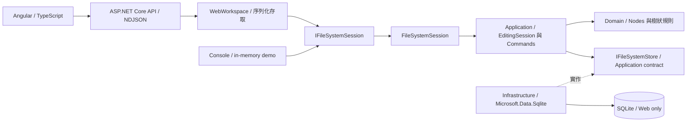

# CloudFileManager

以 **C# / .NET 10、ASP.NET Core 與 Angular / TypeScript** 開發的檔案管理 Side Project，支援樹狀目錄、搜尋排序、標籤管理、Copy / Paste、Delete、Undo / Redo 與 XML 匯出。Web 使用 SQLite 保存資料，Console 提供可重現的 in-memory demo。專案持續探索 Domain Modeling、可復原編輯、相依性邊界與持久化一致性，將操作規則與失敗處理落實為可驗證的行為。**目前管理的是檔案 metadata 與目錄結構**，不包含真實雲端上傳、檔案內容儲存或本機檔案刪除。

[技術亮點](#highlights) · [Demo](#demo) · [架構與取捨](#architecture) · [快速啟動](#quick-start) · [Design Patterns](#patterns) · [測試](#testing) · [架構演進](#evolution) · [AI 工作流](#ai-workflow)

## 技術亮點 <a id="highlights"></a>

| 面向 | 實作重點 |
|---|---|
| 前後端分工 | Angular / TypeScript 負責呈現；ASP.NET Core API 與 C# Core 處理領域規則，以 NDJSON 傳送實際遍歷進度 |
| 分層設計 | Core 區分 Domain / Application；獨立 Infrastructure 專案透過 Application contract 接入 SQLite |
| 可復原操作 | Command 管理編輯歷史，Prototype 保存 Copy 快照；失敗與無變更操作不污染 Undo / Redo |
| 持久化一致性 | SQLite 明確交易，成功回應前完成保存；確認 rollback 時恢復操作前狀態，結果不明時停止 session |
| DI 與測試 | 透過 `IFileSystemSession` 注入 consumer；xUnit 涵蓋核心行為、架構約束、Web 與真實 temporary SQLite |

## Demo <a id="demo"></a>


1. 選取目錄，切換 Name / Size / Extension / Tag 排序；排序只影響 view，不改原始樹與 XML。
2. 搜尋子樹的副檔名或計算容量，觀察實際 traversal 事件驅動的進度與日誌。
3. Copy 後 Paste 到另一目錄、修改 Tags 或 Delete，再以 Undo / Redo 復原。Copy 保存當下快照，同名 Paste 拒絕覆蓋。
4. 匯出選取子樹的 XML；修改後重啟 Web，確認樹保留、編輯歷史清空。

## 架構與取捨 <a id="architecture"></a>

下圖呈現主要呼叫路徑。Infrastructure 實作 Application 介面，Core 不參考 SQLite provider。



- **Domain**：節點、值、複製快照與純查詢 Visitor；節點維護父子 ownership，外部不能任意設定 Parent 或修改 Children。
- **Application**：session、Commands、Undo / Redo、排序、遍歷進度、XML 匯出，以及持久化資料映射與介面。
- **Infrastructure**：以 `Microsoft.Data.Sqlite` 實作參數化 SQL、整棵樹的交易保存與載入驗證，未引入 ORM 或通用 Repository / Unit of Work。
- **入口與組裝**：Web 透過 DI 提供 `FileSystemSession.Instance` 並載入資料庫；Console 初始化固定範例，再顯式傳入 session。

### Architecture Trade-offs

| 決策 | 收益與限制 |
|---|---|
| Core 保留單一 `.csproj` | 以 namespace 區分 Domain / Application，並用 compiled metadata / IL 測試約束依賴方向；不是 assembly 層級隔離 |
| Singleton 搭配 DI | consumer 透過介面取得 session；production 仍是 single-process shared session，DI lifetime 不代表獨立 session |
| Web 序列化存取 | 避免 API 同時修改共享狀態；Core 不承諾 thread-safe，多個瀏覽器共用樹與歷史，沒有使用者隔離 |
| 每次變更保存完整樹 | 交易邊界容易稽核，但成本為 **O(nodes + tags)**，同步保存會阻塞 session；每個 DB 僅支援一個 Web application owner |
| 區分 durable / transient state | 保存 ID、階層、順序、metadata、Tags 與 revision；Clipboard、Undo / Redo 與畫面狀態不持久化 |

**Persistence Consistency** — Delete / Paste / Tag / Undo / Redo 的成功變更皆在回報成功前完成交易，歷史只在 durable commit 成功後發布。確認 rollback 時，恢復操作前的樹與 revision，保留 Clipboard 與完整歷史，允許重試。若無法確認 commit 結果，session 進入 unavailable 狀態，停止後續變更，需處理原因並重啟，避免延續可能不一致的狀態。無效或不支援版本的資料庫會拒絕啟動，不自動覆寫。

**Domain Model** — `FsNode` 統一 `DirectoryNode` 與 `WordFile`、`ImageFile`、`TextFile`，各檔案保留頁數、解析度或編碼等 metadata。容量以整數 bytes 保存，1 KB = 1024 B；遍歷使用明確 stack。XML 處理名稱合法化、碰撞與 escaping，作為展示／匯出格式，不作為可逆保存協定。

延伸閱讀：[Core 分層設計](spaces/core-layering-refactor/sa/design.md) · [DI 設計](spaces/session-lifecycle-di-implementation/sa/design.md) · [SQLite 實作](spaces/sqlite-persistence-architecture/dev/implementation.md) · [Web schema](src/CloudFileManager.Infrastructure/Schema/v1.sql)

## 快速啟動 <a id="quick-start"></a>

需 **.NET 10 SDK** 與 **Node.js**（版本範圍見 [package.json](src/CloudFileManager.Angular/package.json)）；首次執行需還原 NuGet / npm dependencies。以下命令從 repository 根目錄開始。

**Web UI**
```sh
cd src/CloudFileManager.Angular
npm ci
npm run build
cd ../..
dotnet build CloudFileManager.slnx -c Release
dotnet run --project src/CloudFileManager.Web -c Release --no-build -- --urls http://localhost:5080
```

開啟 [http://localhost:5080](http://localhost:5080)。ASP.NET Core 提供 Angular build 產物；單獨 `dotnet build` 不會產生前端。開發時可在 Angular 目錄另執行 `npm start`，將 `/api` proxy 到 5080。

預設 DB：`src/CloudFileManager.Web/App_Data/filesystem.db`（已由 Git 忽略）。可用環境變數 `FileSystem__DatabasePath` 或參數 `--FileSystem:DatabasePath /path/to/filesystem.db` 指定位置。首次初始化才建立範例樹；重新整理沿用 server session，重啟則載入已保存的樹並清空 Clipboard、History 與畫面 runtime state。

**Console Demo**
```sh
dotnet build CloudFileManager.slnx -c Release
dotnet run --project src/CloudFileManager.Console -c Release --no-build
dotnet run --project src/CloudFileManager.Console -c Release --no-build -- --xml
dotnet run --project src/CloudFileManager.Console -c Release --no-build -- --bonus
```

依序展示樹／容量／搜尋與訪問紀錄、純 XML、排序／編輯／Tags／Undo / Redo。Console 使用固定範例與時間，維持 deterministic in-memory 行為，不讀寫 Web DB；`--bonus` 為既有 CLI 名稱。

## Design Patterns <a id="patterns"></a>

以操作需求與維護成本決定設計，**不以 pattern 數量為目標**。以下七項各自解決具體問題，也帶來相應代價。

| Pattern | 問題與實作位置 | 取捨 |
|---|---|---|
| Composite | [FsNode / DirectoryNode](src/CloudFileManager.Core/Domain/Nodes/Nodes.cs) 統一檔案與目錄的子樹操作 | 需維護父子 ownership 與結構合法性 |
| Strategy | [SortedView / Sort Strategies](src/CloudFileManager.Core/Application/Sorting/Sorting.cs) 切換名稱、大小、副檔名與標籤排序 | 增加介面與類別，換取可替換與獨立測試 |
| Command | [EditCommands](src/CloudFileManager.Core/Application/Commands/EditCommands.cs) 與 [EditingSession](src/CloudFileManager.Core/Application/Sessions/EditingSession.cs) 管理編輯與 Undo / Redo | 歷史占用記憶體，失敗時需維持狀態一致 |
| Visitor | [查詢 Visitors](src/CloudFileManager.Core/Domain/Visiting/QueryVisitors.cs) 與 [XmlExportVisitor](src/CloudFileManager.Core/Application/Export/XmlExportVisitor.cs) 分離查詢與匯出演算法 | 新增 Node type 時需更新 visitor 介面與實作 |
| Singleton | [FileSystemSession.Instance](src/CloudFileManager.Core/Application/Sessions/FileSystemSession.cs) 集中 Root、Clipboard 與 History | 全域 mutable state 增加耦合，唯一性不保證 thread safety |
| Observer | [TraversalProgressSource](src/CloudFileManager.Core/Application/Traversal/TraversalProgress.cs) 經 Web / NDJSON 更新實際遍歷進度 | 訂閱須釋放，進度依 traversal 事件推進 |
| Prototype | [NodeSnapshot](src/CloudFileManager.Core/Domain/Prototypes/NodeSnapshot.cs) 保存 Copy 快照，Paste 建立新 ID | 完整快照占用記憶體，貼上原子性由 Command 流程負責 |

## 測試與驗證成果 <a id="testing"></a>

以下為 **2026-10-07 已保存的驗證結果**；完整命令、exit codes 與修正紀錄見 [TEST report](spaces/sqlite-persistence-architecture/test/test-report.md)，不代表每次更新 README 都重新執行測試。

| 驗證範圍 | 結果與涵蓋內容 |
|---|---|
| C# / xUnit v3 | **127/127 PASS**：Core 14、Bonus 20、Architecture 18、Web 46、Persistence 29 |
| Architecture | 上述 18 項包含 6 項 Core layering checks，涵蓋依賴方向與 mutation caller 約束的負向案例 |
| Python schema | **18/18 PASS**：基本 schema 12、Tag schema 6 |
| Angular NDJSON | **8/8 PASS**：串流解析測試，非整體 UI E2E 覆蓋 |
| 建置與整合 | Release Rebuild、Angular production build、Console / Web smoke、SQLite process restart **PASS** |
| 瀏覽器 | 真實 XML download 與 Reference A / B 視覺回歸 **PASS**，見 [browser review](spaces/sqlite-persistence-architecture/test/browser-review.md) |

Persistence 使用真實 temporary SQLite，涵蓋保存／重啟、SQL 寫入失敗、rollback、版本與資料驗證；commit acknowledgement 不明透過 test-only adapter 模擬，未模擬實體斷電或硬體故障。Web xUnit 直接測試 `WebWorkspace`，HTTP、下載與視覺檢查另行驗證。以下命令從 repository 根目錄執行；schema 測試需 Python 3.9+ 與標準庫 SQLite。

```sh
cd src/CloudFileManager.Angular
npm ci
npm test
npm run build
cd ../..
dotnet build CloudFileManager.slnx -c Release -t:Rebuild
dotnet test CloudFileManager.slnx -c Release --no-build
python3 tests/verify_schema.py
python3 tests/verify_tag_schema.py
```

## Architecture Evolution <a id="evolution"></a>

| 技術階段 | 演進重點 |
|---|---|
| Domain foundation | 建立樹狀模型、查詢與 XML；隨需求重新評估 Visitor / Singleton，見 [基礎模型](spaces/cloud-file-manager/summary.md)與[設計決策](spaces/design-pattern-enhancement/sa/design.md) |
| Editing model | 加入可復原編輯，逐步建立 Command 歷史與 Copy 快照，見 [核心操作](spaces/visitor-singleton-enhancement/summary.md)與[Web 整合](spaces/reference-ui-replication/status.md) |
| Web application | 建立 Web UI、Observer / Prototype，完成[視覺修復](spaces/reference-ui-visual-recovery/summary.md)及 [Angular 遷移](spaces/angular-frontend-migration/status.md)，保留 C# API / Core 責任 |
| Architecture | [分離 Domain / Application](spaces/core-layering-refactor/summary.md)，加入架構依賴測試 |
| Testability | [遷移 xUnit](spaces/xunit-test-migration/summary.md)，保留既有 assertions 與邊界案例；[導入 session contract 與 DI](spaces/session-lifecycle-di-implementation/summary.md)，明確分配初始化責任 |
| Persistence | [加入 Web-only SQLite](spaces/sqlite-persistence-architecture/summary.md)、交易失敗處理與重啟驗證，Console 維持 in-memory |

完整 evidence 保存於 [spaces/](spaces/)，包含提案、失敗、修正與取消。[TASK-009](spaces/session-lifecycle-di-refactor/status.md) 為 **CANCELLED / NOT IMPLEMENTED**；早期 Web 視覺驗收失敗與後續修復也保留原貌，各階段結果以當時的 status / test report 判讀。

## AI Agent Workflow <a id="ai-workflow"></a>

`Human Request → PM → Grill Me → SA → Grill Me → DEV → Grill Me → TEST → Grill Me`

由**同一 agent 依序切換 PM → SA → DEV → TEST 角色**，不是四個獨立 agents 審查。各階段以專案自訂 Grill Me 挑戰需求與技術假設，透過 **Human-in-the-loop** 由開發者保留範圍與架構決策權。

需求、設計、交接與測試紀錄存於 `spaces/`；Gate 使用 PASS / REWORK / BLOCKED，保留失敗、退回原因、修正與重驗 evidence。這是 agent 遵循的開發流程，並非自動排程服務。參考：[workflow](docs/workflow.md) · [SDLC skill](.agents/skills/sdlc-workflow/SKILL.md) · [Grill Me skill](.agents/skills/grill-me/SKILL.md)。

## Project Structure

```text
src/
  CloudFileManager.Core/            # Domain / Application（同一 project）
  CloudFileManager.Infrastructure/  # SQLite store / versioned schema
  CloudFileManager.Web/             # ASP.NET Core API / WebWorkspace / DI
  CloudFileManager.Angular/         # Components / presentation store / NDJSON
  CloudFileManager.Console/         # 固定資料的 Console demo
tests/                             # 五個 xUnit projects / Python schema checks
.agents/skills/                    # SDLC workflow / Grill Me
docs/                              # Demo 截圖 / workflow 說明
spaces/                            # 需求、架構決策、實作與驗證歷史
```
