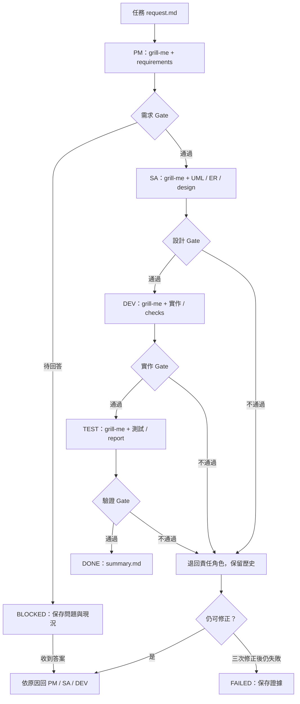

# Design Pattern 四角色工作流

你輸入一項任務，AI 依序扮演 PM、SA、DEV、TEST。每個角色都讀取並執行同一份 grill-me 技能，在交接前檢查假設，留下問題、回答來源、決策與成果。所有任務紀錄放在 `spaces/<task>/`，其中 task 是任務名稱，例如 `cloud-file-manager`。

工作流已在本專案實際執行；作業實作與驗證見根目錄 README。它是 agent 執行指引，不含背景排程或獨立的四 agent 服務。

## 三個部分

| 部分 | 功用 | 位置 |
|---|---|---|
| Workflow skill | 控制順序、驗收、回退、續跑 | `.agents/skills/sdlc-workflow/SKILL.md` |
| Grill-me skill | 逐題挑戰假設並記錄決策 | `.agents/skills/grill-me/SKILL.md` |
| 任務空間 | 保存實際工作成果與歷史 | `spaces/<task>/` |

PM 管需求和驗收；SA 管模型和設計；DEV 管實作；TEST 管實際驗證。這裡將圖片中的 Architect 對應 SA、QA 對應 TEST，各角色自己有交接 Gate，不額外增加第五個 Reviewer 角色。



## 開始使用

把此資料夾當成專案根目錄，或將其中 `.agents/`、`AGENTS.md` 與 `spaces/` 合併進你的專案。若原本已有同名檔案，先比較合併，勿直接覆蓋。

在該專案開啟 Codex，輸入：

```text
請使用 $sdlc-workflow，執行 spaces/cloud-file-manager/request.md。
每個角色都使用 $grill-me，把問答與決策即時寫進自己的 grill-me.md。
依 PM → SA → DEV → TEST 交接；驗收不通過就回退。
需要我決定的問題逐題問我，不得把 AI 提案當成我的答案。
```

若技能選單尚未載入，直接指定「讀取並遵循 .agents/skills/sdlc-workflow/SKILL.md」，先確認該專案是目前工作目錄；必要時重啟 Codex。

新增其他任務時使用新的 `spaces/<task>/request.md`；同一任務續跑可說：

```text
請使用 $sdlc-workflow 繼續 spaces/cloud-file-manager，先讀 status.md
與 timeline.md，從未完成階段接續，不覆寫先前問答或測試證據。
```

## 執行後的檔案

下列為工作流執行後應有的結構；尚未執行的角色不預先填入假紀錄。

```text
spaces/cloud-file-manager/
├── request.md
├── status.md
├── timeline.md
├── pm/
│   ├── grill-me.md
│   ├── requirements.md
│   └── handoff.md
├── sa/
│   ├── grill-me.md
│   ├── domain-model.md
│   ├── er-model.md
│   ├── design.md
│   └── handoff.md
├── dev/
│   ├── grill-me.md
│   ├── implementation.md
│   ├── checks.md
│   └── handoff.md
├── test/
│   ├── grill-me.md
│   ├── test-plan.md
│   ├── test-report.md
│   ├── defects.md         # 有缺陷時產生
│   ├── evidence/
│   └── handoff.md
└── summary.md             # 所有 Gate 通過才產生
```

程式碼在專案 `src/`，測試在 `tests/`，任務資料夾用相對連結指向實際檔案。程式的 Traverse Log 是考題的功能證據；角色 Markdown 是 AI 工作流的執行證據，兩者都要保留。

## Grill-me 紀錄長相

以下只是格式示例，未曾向使用者取得這個回答：

```markdown
## R1 / PM-Q001
- 問題：2MB 是 2,000,000 B 還是 2,097,152 B？
- 影響：會改變總容量與測試預期值。
- 來源：考題混合 KB、MB、B，沒有定義換算基數。
- 建議：內部存 bytes，換算規則寫進 requirements.md。
- 回答來源：AI_PROPOSAL
- 使用者回答：尚無
- 狀態：OPEN
- 後續：PM 確定容量契約，SA/DEV/TEST 共用。
```

四份教學範例可讀：[PM](../examples/pm/grill-me.md)、[SA](../examples/sa/grill-me.md)、[DEV](../examples/dev/grill-me.md)、[TEST](../examples/test/grill-me.md)。它們與正式任務紀錄分開，均標明未執行。

真正的工作痕跡是「問了什麼、依據什麼決定、改了哪個檔案、執行什麼驗證、為何交接或退回」，不只是寫一句「PM 已完成」。

## 來源與限制

- `grill-me` 是本次自訂的專案版，未取得使用者指定的第三方原版。日後提供原版時，先讀取、核對授權與行為，再整合；避免同名技能混淆。
- 考題內容來自使用者提供的 Word；流程視覺參考來自使用者提供的圖片。圖片中的自動 Git 操作與額外 Reviewer 不納入預設。
- 專案內 `.agents/skills` 與 `SKILL.md` 的放置依據：[OpenAI 官方 Build skills](https://learn.chatgpt.com/docs/build-skills)。
- 原始套件驗證記錄保存在 `VALIDATION.md`；本次實際執行結果見 `../spaces/cloud-file-manager/test/test-report.md`。
