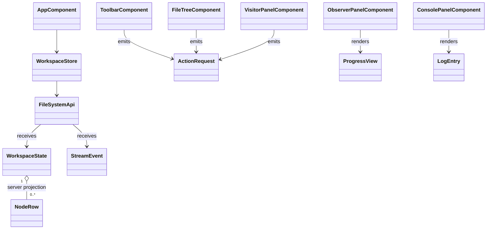

# Angular presentation model / domain unchanged

NodeRow is read-only DTO projection, not Composite/domain node. Domain UML unchanged: TASK004 sa/domain-model.md. Existing sevenPatterns remain C# production responsibilities; Angular DI service is not a replacement GoF FileSystemSession Singleton.
