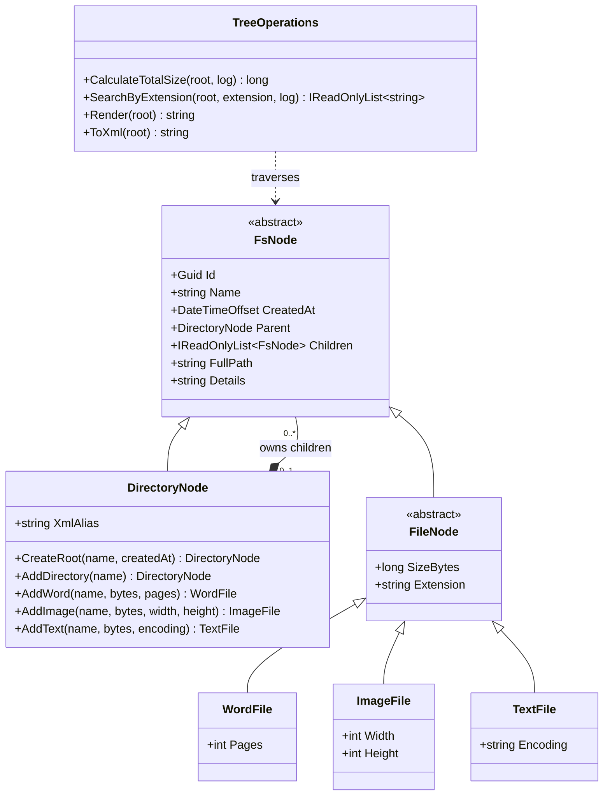

# UML 領域模型

```mermaid
classDiagram
    class FsNode {
        <<abstract>>
        +Guid Id
        +string Name
        +DateTimeOffset CreatedAt
        +DirectoryNode Parent
        +IReadOnlyList~FsNode~ Children
        +string FullPath
        +string Details
    }
    class DirectoryNode {
        +string XmlAlias
        +CreateRoot(name, createdAt) DirectoryNode
        +AddDirectory(name) DirectoryNode
        +AddWord(name, bytes, pages) WordFile
        +AddImage(name, bytes, width, height) ImageFile
        +AddText(name, bytes, encoding) TextFile
    }
    class FileNode {
        <<abstract>>
        +long SizeBytes
        +string Extension
    }
    class WordFile { +int Pages }
    class ImageFile {
        +int Width
        +int Height
    }
    class TextFile { +string Encoding }
    class TreeOperations {
        +CalculateTotalSize(root, log) long
        +SearchByExtension(root, extension, log) IReadOnlyList~string~
        +Render(root) string
        +ToXml(root) string
    }
    FsNode <|-- DirectoryNode
    FsNode <|-- FileNode
    FileNode <|-- WordFile
    FileNode <|-- ImageFile
    FileNode <|-- TextFile
    DirectoryNode "0..1" *-- "0..*" FsNode : owns children
    TreeOperations ..> FsNode : traverses
```

FsNode.Parent 只有 root 可為 null；FileNode 與非 root DirectoryNode 必須有一個 parent。上圖 0..1 是共同基底多重性，檔案子類別不允許 0。檔案為 Composite 葉節點，Children 空集合。DirectoryNode 控制建立子節點並在驗證成功後附加；對外不能重新指定 Parent。
