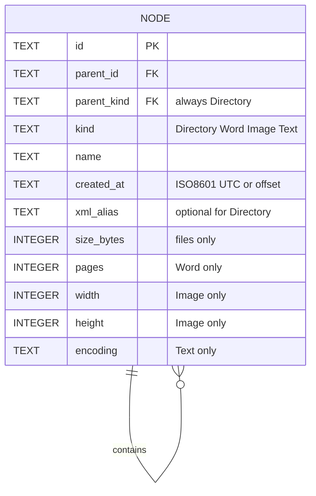

# ER 與繼承映射

- 以 Table per Hierarchy 映射 UML 繼承，kind 判別類型；CHECK 約束各型別必填與禁止的欄位。
- 關係為 parent Directory 擁有 0..N 子節點；root 無 parent，所有 file 與非 root directory 有一個 parent。圖中一般關係的 root 例外由 CHECK / index 處理。
- `(parent_id, parent_kind)` 外鍵指向 `(id, kind)`，parent_kind 固定 Directory，阻止 file 作 parent。
- root 的部分唯一索引保證至多一個 root；應用初始化建立一個 root。非空樹必須有 root，空 schema 合法。
- 同層 name 唯一、size_bytes 非負，pages/width/height 正數，名稱禁止空白／分隔符／控制字元。
- 節點 id/kind/parent_id 不可更新，新增時 parent 必須已存在且不是自身；此限制維持無環樹，與尚未提供 move 的公開 API 一致。
- created_at 格式由應用輸出 ISO8601；schema 檢查非空，並不宣稱 SQL 自行完成完整日期驗證。
- [schema.sql](../../../schema.sql) 是可執行 SQLite DDL；應用目前不執行資料庫存取。驗證時必須開啟 foreign_keys。

相容性修正 DEF-001：DDL 不要求 STRICT，整數欄位以 typeof CHECK 驗證；SQL trim 處理 ASCII 空白，應用以 IsNullOrWhiteSpace 完成 Unicode 空白驗證。
