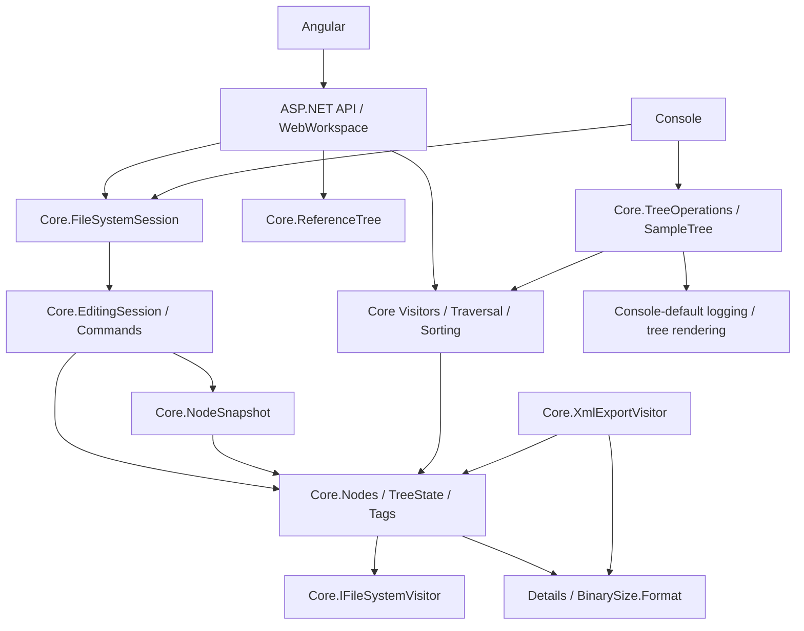
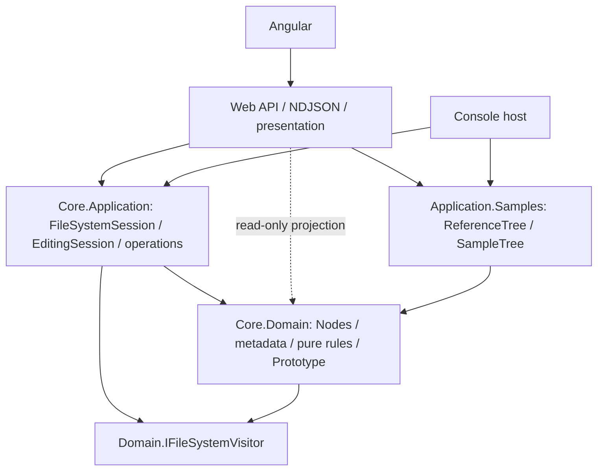

# SA design R1 — architecture proposal, not implemented

Baseline b4418bd1b06ec9467c6b31f255b1058acf03a21c。PM R1→SA R1；本輪只有文件。完整逐type依賴見 inventory.md（11個.cs，38types含private nested），精確declaration行號見type-index.json。

## 1. Current architecture

箭頭代表依賴／呼叫，不是資料流。



目前只有一個Core.csproj，單一CloudFileManager.Core namespace，沒有外部package依賴。Web/Console及三個C#runner直接referenceCore；WebTests referenceWeb並使用Core。不是現存project循環，而是責任與存取邊界沒有清楚區分。

## 2. Current problems

1. Nodes.cs混結構不變式、revision、binary conversion及中文Details格式。Domain沒有直接引用UI/session，但輸出責任滲入model。XmlAlias為既有匯出metadata，不等於XmlWriter依賴。
2. EditingSession保存clipboard/history並做live/revision/use-case checks；FileSystemSession是application lifecycle，卻與Domain同namespace。Commands有可逆操作狀態，不是Node本身規則。
3. 同assembly internal是實際耦合：EditingSession.State、Commands.Insert/Remove/SetTag、snapshot constructors/LoadTags、ReferenceTree.LoadTags。單純拆csproj會失敗；不能為了編譯把所有internal改public，也不建議以InternalsVisibleTo(Application)假裝完全隔離。
4. Visitors.cs同檔混Domain dispatch contract、純計算visitor、帶TextWriter和Observer的operation traversal。全部搬Application會令FsNode.Accept反向依賴；必須拆contract與implementations。
5. TreeOperations混query setup、預設Console.Out、ASCII樹render、XML。XmlExportVisitor已真實使用，不能退回純demo。SizeSortStrategy.Size有自己的silent checked迭代計算，並非呼叫SizeVisitor；本次不藉分層順便改演算法。
6. Sorting是display-only policy，不維護Children invariant；ReferenceTree/SampleTree是bootstrap資料，不是Domain規則。Web的selection、counts、formattedrow、NDJSON、log文案是合理presentation；不可全移Application造成HTTP依賴。

## 3. Recommendation / project choice

**建議本TASK採一個Core.csproj內真正的folder + namespace layering**：CloudFileManager.Core.Domain與CloudFileManager.Core.Application。理由是規模38types／無persistence adapter；兩assembly除了reference更動，還須設計新的受控tree mutation/undo attachment contract。現在不增加一組只為跨assembly的public API。

|方案|收益|成本／限制|判定|
|---|---|---|---|
|僅搬folder，namespace仍相同|最少改動|依賴難辨識，無明確boundary|拒絕|
|同Core project，Domain/Application namespaces＋依賴檢查|清楚責任、保持internal mutation封裝，不新增Pattern或全面DI|C#不能阻止同assembly internal越界；需自動檢查及review|本次推薦|
|Domain.csproj + Application.csproj，Application→Domain|編譯器強制reference direction|需public受控mutation API或Domain edit engine；增加可用API面與undo/invariant風險|可行，但本次非必要|
|兩project＋friend assembly bypass|少改internal|架構隔離名實不符，Application綁Domain所有internals|不推薦|

若Human要求compiler-enforced boundary，回SA R2設計兩project的**受控mutation能力**後才能DEV；不得把本R1直接實作成兩csproj。沒有宣稱namespace隔離等於compile-time隔離。

## 4. Target architecture



Web直接讀Domain metadata做projection是允許的；不可因此直接SetTag/Insert繞過EditingSession。Domain不得import/fully-qualified reference Application/Web/Angular；不從Domain回callapplicationservice。Sameproject沒有ProjectReference箭頭；圖示為source dependency rules。

```text
src/CloudFileManager.Core/                 # 保留原csproj
  Domain/
    Nodes/                               # FsNode等、TreeState
    Values/                              # TagKind、BinarySize.From
    Visiting/                            # IFileSystemVisitor、SizeVisitor、ExtensionSearchVisitor
    Prototypes/                          # INodePrototype、NodeSnapshot（含Row）
  Application/
    Sessions/                            # FileSystemSession、EditingSession
    Commands/                            # IEditCommand及三commands
    Sorting/                             # strategy、SortedView、direction、StableSort
    Traversal/                           # FileSystemTraversal、Progress及Source
    Queries/                             # TreeQueries（size/search orchestration）
    Export/                              # XmlExportVisitor、TreeXmlExporter
    Formatting/                          # NodeDetailsFormatter、BinarySizeFormatter、TagCatalog
    Rendering/                           # TreeTextRenderer
    Samples/                             # ReferenceTree、SampleTree
    TreeOperations.cs                    # 薄相容入口，沒有render/XML演算法
```

文件可按既有小型群組合併，不要求一type一file。Core/publicnamespace變動需caller/test usings調整；不保證未提供的external C# binary consumer相容。HTTP/JSON與產品observable contract則嚴格保持。

## 5. Important responsibility decisions

- **FileSystemSession→Application**：唯一instance、Reset lifecycle、Root/clipboard/history owner；CurrentState仍private。不是Domain entity。維持GoF singleton，Web DI僅composition，不全面DI。
- **EditingSession/Commands→Application**：Copy/Delete/Paste/Tag/undo orchestration與linearhistory。Domain仍負責parentownership/siblingname/revision等不變式。既有IEditCommand足夠，不新增每commandinterface。
- **Visitors不全相同**：IFileSystemVisitor屬Domain供Accept；SizeVisitor／ExtensionSearchVisitor是純treequery規則，可置Domain；XmlExportVisitor屬Application.Export，依賴System.Xml及formatter；Traversal及Observer source在Application，處理operation執行/log/progress，Domain.Accept不感知進度。
- **Sorting→Application.Sorting**：使用者顯示策略，非Domain mutation；保留strategy介面及stable semantics，不抽新service。SizeSortStrategy.Size仍silent checked subtree計算，不本輪合併演算法。
- **NodeSnapshot/Prototype→Domain.Prototypes**：純node值快照/deepclone，不持有clipboard/history，保持internal。Application的clipboard僅持有prototype。CloneInto目前建立有Parent但尚未attached的copy，由PasteCommand完成attach；不得改成提早mutation。
- **ReferenceTree/SampleTree→Application.Samples**：bootstrap factory，Web/Console composition呼叫；不是runtime use-case、不新增sampleproject。允許初始化LoadTags但僅sessionReset前；不產生Command history。
- **TreeOperations拆責任，不刪相容入口**：CalculateTotalSize/SearchByExtension委派TreeQueries；Render委派TreeTextRenderer；ToXml/SerializeXml委派TreeXmlExporter。TreeOperations位Application，是既有API入口，不是新Pattern。預設Console.Out僅薄legacywrapper保留以保護Console observable；新query/traversal需明確log參數/null silent，Web不走legacydefault。
- **Details/formatting**：從FsNode移除中文Details presentation；搬到Application.NodeDetailsFormatter.Format(node)。XmlExportVisitor及Console renderer/BonusDemo使用相同formatter，確保原字串一致。BinarySize.From留Domain；Format搬BinarySizeFormatter。TagKind留Domain，TagCatalog.Color搬Application.Formatting。既有Details使用處（包含測試state serialization）機械式改call，不改預期。這是C#sourceAPI調整，須納入Human核准範圍。
- **XmlAlias保留**：已有schema/fixture/snapshot metadata，為相容保留Domain純string；Domain不做XMLescaping/XmlWriter。抽離metadata到side-table會引入不必要狀態同步，不納入。

## 6. Dependency/access rules and enforcement

1. Domain只依賴BCL與Domain；不得System.Console/TextWriter/XmlWriter/ASP.NET/Angular/session/sorting UI；Path.GetExtension是字串extension判斷非filesystem I/O，可保留。
2. Application只依賴Domain/BCL與自身；不引用Web/Console project，不持有HTTP DTO。Formatting/Export可以System.Xml/Text，不新增databasepackage。
3. Web維持request validation/selectionfallback/rowformat/tagcounts/logwording/eventtranslation/downloadmetadata/semaphore及composition；domain規則委派Application/Domain。
4. 在同assembly中Application.Commands可用Domain.Insert/Remove/SetTag；EditingSession可讀State.Revision；Application.Samples可用LoadTags。其他Application code禁止直接mutation。保留internal，沒有大面積public setter。
5. DEV後在現有console test runner補layer驗證，不換xUnit：assemblymetadata／IL member reference或Roslyn semantic檢查Domain型別不得引用Application/Web；檢查包括base/interface/generic/memberbody，不能只grep using。另列白名單mutationcaller。負向fixture證明檢查抓到fully-qualified呼叫；fixture在tests，不在production。優先BCL反射/IL避免新toolpackage。這是架構guard，不是新增產品Pattern。
6. 依賴guard是build/test gate，不是compiler reference boundary；若團隊不接受此限制，選兩project並回SA補設計。

## 7. Seven patterns after layering

|Pattern|Owner/dependency|Production保留|
|---|---|---|
|Composite|Domain nodes→Domain children|Web/Console tree|
|Strategy|Application.Sorting→Domain read model|SortedView顯示排序|
|Command|Application history/commands→Domain mutations|EditingSession/Singleton委派|
|Visitor|Domain Accept→Domain contract；Domain純visitors與Application XML都實作contract|size/search/XML真實traversal|
|Singleton|Application.FileSystemSession→EditingSession/DomainRoot|Web/Console共用runtime；不新增singleton|
|Observer|Application traversal→ProgressSource；Web訂閱→NDJSON|真實visit後progress，不timer|
|Prototype|Domain snapshot→Domain constructors；Application.Copy持有|copy-time snapshot與獨立Paste|

## 8. Explicitly unchanged

HTTP routes、ActionRequest/state/NDJSON fields及event order、error behavior、Angular source/style/build、Reference A/B、seed名稱/metadata/tags、ID/Parent/Children原則、binarybytes/overflow、searchexactextensioncase-insensitive、stablegroup排序、snapshot完整性、pasteconflictatomic、history/no-op/Redo、selectionfallback、globaltagcounts、XML字串/escaping/ordering、Console輸出/exit codes、Reset/thread-safety限制；schema、skills、TASK001～006全部不改。現有tests期望與數量不減少；只允許批准後C#reference/usings/formattercall migration及新增layerassertions。

## 9. Migration sequence (not authorized yet)

1. Human批准本R1範圍；新DEV STARTED/grill，保存baseline fingerprints。
2. 移Domain及visitorcontract/snapshot，拆formatting以避免Domain反向依賴；保持internal，不改mutation演算法。
3. 移Application sessions/commands/sort/traversal/export/samples；TreeOperations拆delegatehelpers，傳遞null/log保持legacydefault。
4. 更新Web/Console/C#tests的namespace及Details/BinarySizeFormatcall，保留routes/DTO/expectedassertions；不改Angular。
5. 加dependencyguard及negativecoverage；DEVcompile/basiccheck後handoff。
6. TEST fresh84baseline+8Angular、dependencytests、ReleaseRebuild/Console、realXMLdownload、A2914×948/B2028×682、observerorder/history/snapshotregression；結果數量分列不灌水。無source變動也不沿用舊PASS。
7. Gate失敗記缺陷、責任角色與rework_count，不覆寫；Human未授權commit/push。

## 10. Risks / trade-offs

Namespace隔離需discipline/guard；internal跨層是窄白名單而非完全隔離。移Details容易改中文/空白/XML輸出，須fixture及Console比對。類別GetType().Name用於snapshot及Webkind，保留class名稱。改visitorcontract位置不能產生兩個同名interface。拆TreeOperations不能增加額外traversal/progress或不同logdefault。Singleton測試依序Reset不變；Samples不可在startup自動執行commands。拆兩csproj有更強隔離，但目前須額外mutationcontract設計，避免為展示分層而擴大public API。

## 11. Human approval required

**H-ARCH-001 OPEN**：是否核准本R1「單Core project + Domain/Application namespaces + dependencyguard」及其附帶的formatting責任搬移、必要C#callsite/testusing調整？這是Human明確要求的architectureapproval，不是重問產品語意。

推薦核准本R1後才DEV；若要求Domain.csproj/Application.csproj，先SA R2定義受控mutation API與test strategy，不直接DEV。PM/SA文件Gate可PASS，但Task BLOCKED等待Human，DEV/TEST NOT_STARTED。沒有實作或測試PASS宣稱。
