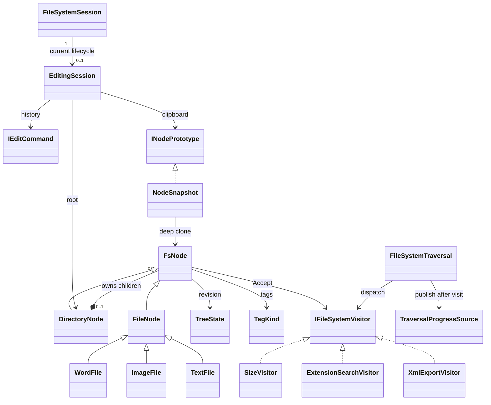

# Proposed layered domain model R1

No implementation changed. D=Domain, A=Application inside existingCore project. Details moves out; identity/topology/metadata invariant unchanged.

Domain: Nodes/TreeState/TagKind/visitorcontract/puresize-searchvisitors/Prototype。Application: session/history/commands/traversal/Observer/XMLvisitor。Diagram arrows fromApp toDomaincontract do not implyDomain dependsXMLvisitor. OnlyRoot hasnullParent; detachedcommandnodeskeepParentbutarenotliveChildren. NoCycles/multipleparents; immutableParent;duplicate siblingOrdinalreject. Commands preserveidentity/index onundo; snapshotPasteassignsnewIDs. TreeStatebelongsmodel and is notSingleton/sessionstate.

Data storage unchanged; sample/bootstrapnotDomainentities. No Repository/newaggregatepattern introduced. Seeinventory/designforaccessrules.
