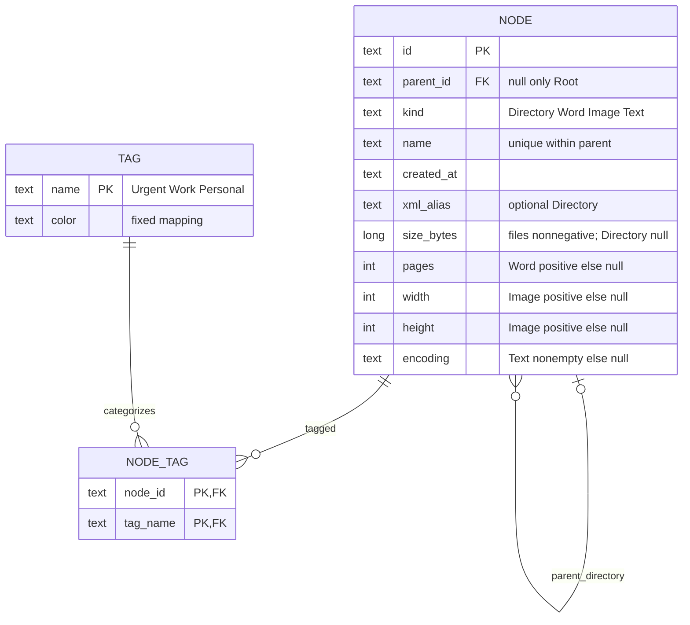

# ER model impact — unchanged

TASK007hasnodatabaseimplementation/schemachange. Existing executable schema.sql/schema-tags.sql remainauthoritative; thisdiagramisplanningreferenceonly.

ExistingcompositeFK(parent_id,parent_kind)requiresDirectoryparent;oneRootpartialuniqueindex;fileparentNOTNULLviacheck;unique(parent_id,name);kind-specificCHECKs;immutableid/parent/kindtrigger;fixedTagname/color;duplicateNODE_TAGblocked. Parent_kind anduniqueness(id,kind)areSQLsupportcolumns(notnewDomainobjects). No persistedClipboard/history/session/progress/highlights. Movingnamespace/formatter doesnotchangeTPHcolumns,XmlAliasorXMLoutput. NoSQLite/EF/Repositoryaddition.
