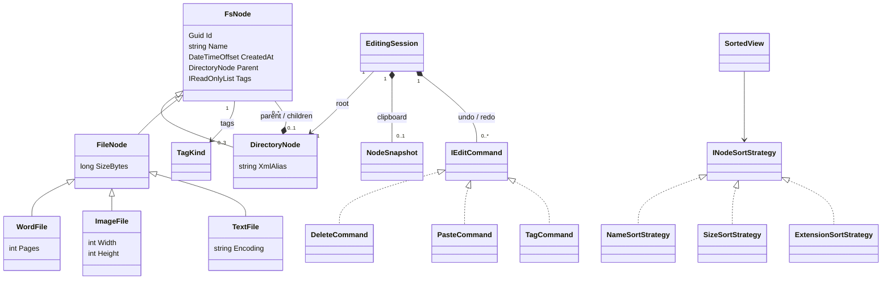

# Domain model v1

只有 Directory root 無 parent；所有檔案父節點恆為 Directory。Parent／Name／metadata readonly，Children 不可由外部任意增刪。Delete 將節點移出活樹，command 保存 tombstone 原 parent 及 index 以 Undo；不在活樹的節點不是另一個 root。Paste 新副本新 ID，完整 metadata／Tags 複製，parent 對映到新子樹或目的目錄，不共用可變集合。revision 屬每棵樹而非全域；session 之外的結構更新使 session 過期並拒絕繼續。
