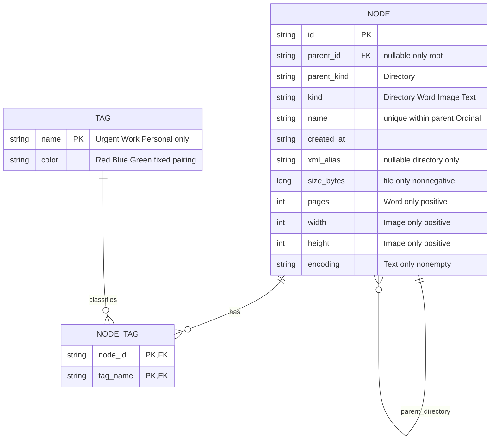

# ER model v1

原 schema.sql 保留 TPH、單 root、複合父目錄 FK、防自父／immutable parent、型別 metadata CHECK。新增 schema-tags.sql 定義固定 catalog 三筆與不可修改／刪除 trigger，NODE_TAG 複合 PK 防重複，兩欄 NOT NULL，node FK ON DELETE CASCADE、tag FK；支援 Directory 與 File 多 Tag。

ER 表示活樹資料，Undo tombstone、clipboard、history、revision 是 session 執行狀態，不建資料表。無 persistence adapter。未實作 DB subtree delete：若未來做 persistence，需交易內由葉到根刪除以符合既有 parent FK，Undo 也須交易還原；本次只以 SQLite 驗證 schema，不把記憶體 command 宣稱為 DB command。
