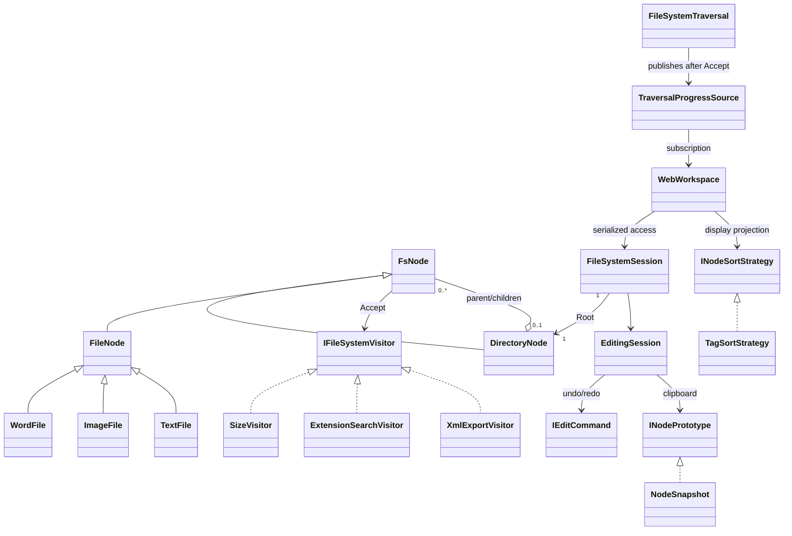

# SA domain/UML R1

Root parent=null；每File恰一Directory parent，其他Directory恰一parent。禁止public parent setter/任意attach。UI DTO不是第二個domain。NodeSnapshot值型row保留metadata/Tags、不保留source references；Paste clone的新identity與Command ownership獨立。
