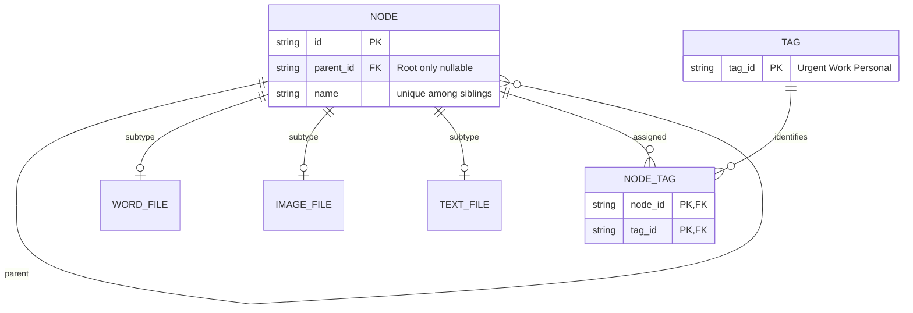
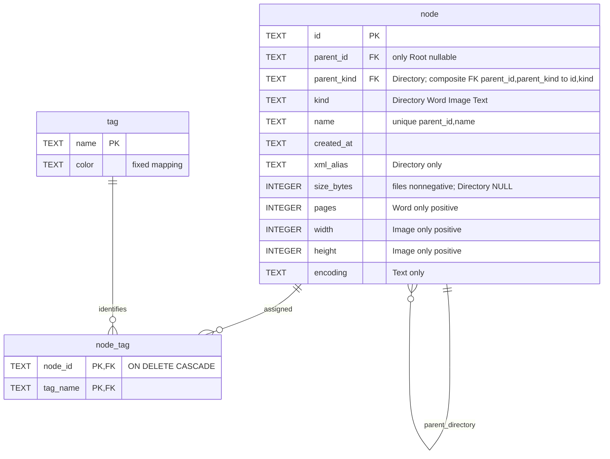

# SA ER R1

沿用TASK001/002 schema，無persistence與新table。

此圖為既有關聯概念圖，實際欄位/constraints以schema.sql與schema-tags.sql為準；不新增資料庫。Root唯一/Directory parent/subtype唯一與非負bytes等原限制保持。Session/navigation/observer/log是process memory，不存table；Tags no duplicate。

## R2 — corrected physical ER (supersedes R1 conceptual subtype tables)

TEST比對schema.sql发现R1把domain subtype誤畫為實體table；實際為single-table inheritance。schema未修改。以下為current物理模型：

所有node id/kind組合unique；one_root partial unique index限制最多一Root；file parent不可NULL，parent_kind固定Directory；structure immutable trigger禁止換id/parent/kind，原text checks/triggers保留。tag固定Urgent/Red、Work/Blue、Personal/Green。無額外subtype tables、無persistence新增。
