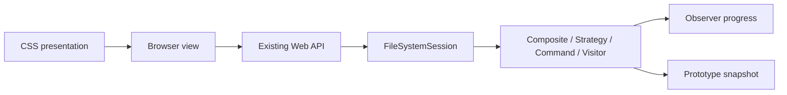

# Domain / UML impact

No domain model changes. Existing model: ../reference-ui-replication/sa/domain-model.md (read-only baseline).

All interfaces/multiplicities/ownership inherited unchanged. This flow diagram is impact context, not replacement domain UML. Hash checks enforce no model/source/schema mutation.
