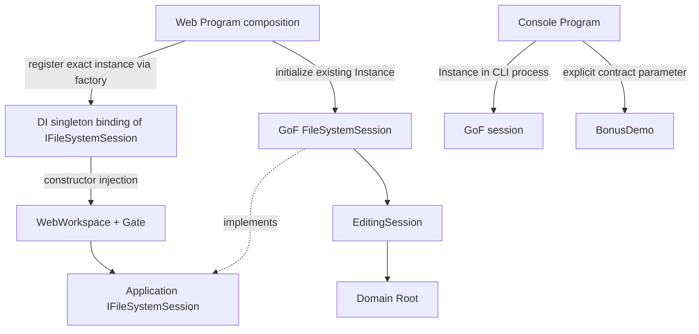

# TASK-010 SA design R1 — proposal only
Baseline: dda64a47d6ad722585dcd492511d08b37d7cf1a4. New evolution, not reopening TASK-009. Current source inspected; no execution verification or DEV performed.

## Current responsibility / dependency inventory
| File/type | Current dependency and lifecycle | Proposed change |
|---|---|---|
| Core/Application/Sessions/FileSystemSession.cs | sealed/private constructor/static Instance; CurrentState holds Root and EditingSession; invalid Reset leaves prior state | Implement one consumer contract; retain constructor/Instance/Reset and real state ownership |
| Core/Application/Sessions/EditingSession.cs | independent real root; revision validation, commands, clipboard, undo/redo | Unchanged; reuse in test-only dependency |
| Web/WebWorkspace.cs:18,27 | hidden Instance; constructor Reset ReferenceTree; own selection/sort/log/matches/progress/Gate | Required session injection; no Reset/seed/locator; receive initial selection |
| Web/Program.cs | DI singleton workspace; GET/POST acquire workspace Gate | Composition factory initializes and registers actual Instance; preserve endpoint/stream/gate behavior |
| Console/Program.cs:14 | direct Instance + SampleTree Reset; Bonus branch delegates initialization | Sole Console composition owner; build mode seed then Reset once |
| Console/BonusDemo.cs:15,44 | acquires Instance, Reset augmented root; Show concrete dependency | Run/Show accept contract, no global lookup or Reset |
| Architecture SessionFixture / A01 / A07–A12 | real singleton Reset/serial/cold child | Preserve actual singleton assertions and lifecycle isolation |
| WebWorkspaceTests | global Reset fixture; multiple cases inspect Instance | Keep real-mode coverage; add isolated injection mode and dependency assertions |

Search of current src confirms direct production Instance consumers only WebWorkspace, Console Program and BonusDemo; Web Program is indirect via workspace. Current Web singleton is per provider, but FileSystemSession state is process global. Two workspaces would reset shared state and keep separate stale navigation/gates; this is source-derived analysis, not a newly run reproduction.

## Current vs proposed architecture


Web and CLI normally run in separate processes. No cross-process memory sharing implied.

## Proposed contract
Application/Sessions/IFileSystemSession.cs in existing Core project; Domain must never depend on it. No DI framework dependency in Core.
```csharp
public interface IFileSystemSession
{
    bool IsInitialized { get; }
    DirectoryNode Root { get; }
    int UndoCount { get; }
    int RedoCount { get; }
    bool HasClipboard { get; }
    void Copy(FsNode node);
    FsNode Paste(DirectoryNode destination);
    void Delete(FsNode node);
    bool AddTag(FsNode node, TagKind tag);
    bool RemoveTag(FsNode node, TagKind tag);
    bool Undo();
    bool Redo();
}
```
Reset deliberately remains concrete lifecycle operation, not part of consumer contract. One cohesive runtime editing boundary; no persistence abstraction, node interface, service provider or general session factory. Root is concrete mutable Domain data, so this is not an immutable/security boundary.

`WebWorkspace(IFileSystemSession session, Guid initialSelection)` validates non-null/initialized dependency and live selection; sets only local presentation defaults. No parameterless overload, optional global fallback, concrete cast or constructor Reset. Existing production initial selection remains API介面定義.docx; test fixture may provide another live node. Constructor failure must not mutate dependency.

## Web composition and ownership
Proposed factory registration, inside Web composition root only:
```csharp
builder.Services.AddSingleton<IFileSystemSession>(_ => {
    var session = FileSystemSession.Instance;
    session.Reset(ReferenceTree.Create());
    return session;
});
builder.Services.AddSingleton<WebWorkspace>(services => {
    var session = services.GetRequiredService<IFileSystemSession>();
    var initialId = /* find API介面定義.docx in the seed root */;
    return new WebWorkspace(session, initialId);
});
```
Factory keeps lazy initialization at first resolution and allows a test-host registration override before resolution without global side effects. Provider lookup is confined to composition, not consumers. No BuildServiceProvider nested container. Reset once at bootstrap, not per request; no hidden IsInitialized reuse heuristic and no automatic Reset on dispose.

One production host/workspace per process, all clients share root/clipboard/history and existing presentation state. Web Gate continues to serialize State and Execute; no new API reads session directly. A second real provider returns same global object and its bootstrap can reset it; distinct gates do NOT protect that unsupported topology. DI does not fix this limitation. No per-user sessions or concurrent Core usage promised.

Static instance survives provider disposal; currently FileSystemSession has no unmanaged resource or IDisposable. Process exit discards in-memory state; restart seeds clean. Core remains non-thread-safe. Tests reusing real Singleton explicitly Reset and serialize. The interface cannot prevent a concrete external caller from bypassing Gate; project boundary checks should restrict normal production static access to composition roots.

## GoF vs DI lifetime
GoF: class controls construction/access to one Instance; preserved with private constructor and actual state ownership.
DI singleton: container reuses registered value per provider; here every provider would point to the same pre-existing GoF object, not independent objects.
Scoped: normally one instance per request/scope; aliasing global Instance adds no isolation. A new independent state per request would lose Copy/Paste/history continuity.
Transient: new service per resolution normally; aliasing Instance still global, and new independent sessions would fragment state. Neither is recommended.
Framework terminology reference: https://learn.microsoft.com/en-us/dotnet/core/extensions/dependency-injection/service-lifetimes (read 2026-10-07). Microsoft generally prefers container-managed singleton and thread-safe shared services. Retaining classic global state is an explicit stakeholder constraint; safety here relies on existing serialized owner boundary, not generic DI safety.

## Console composition
Program obtains Instance, builds SampleTree or Bonus sample including Bonus_Copies BEFORE Reset, then passes IFileSystemSession to BonusDemo.Run/Show. Preserve source/destination identity, sequence/output, XML/default/help/invalid args. No container/Generic Host package needed for simple parameter injection. BonusDemo no locator or Reset.

## Test substitution without invented business rules
Test-only IsolatedTestSession implements contract with independently created Root and actual EditingSession; properties and mutation methods only delegate. It is initialized by its constructor; no fake lifecycle Reset or duplicate command/history/snapshot rules. No new production session engine is needed. Test adapter is not registered in production and does not prove static Singleton correctness.

Preserve current real Singleton regression mode and run the same consumer behavior assertions with isolated dependencies. Contract parity exercises real copy snapshot/conflict/no-op/history/errors in both modes. Actual Web registration must be tested separately for ReferenceEquals(Instance, resolved contract) and an operation affecting that instance; adapter-only tests cannot satisfy production-path acceptance. See testability.md.

## Why this is bounded
Evidence supports one substitute boundary because concrete Singleton is sealed/private, so concrete injection alone cannot provide isolated real consumer fixtures. Existing EditingSession, pure strategies/nodes/visitors/formatters already directly testable; no IXXX expansion. Existing TextWriter sufficient. No storage problem or multiple persistence sources found, so Repository is unjustified. No SQLite/EF/persistence implementation.

## Risks / compatibility
Global mutable production ownership remains, unlike isolated test instances. Adapter can drift; parity and real production/lifecycle coverage mitigate. Exposed Root remains mutable. Same global with multiple workspaces/gates unsupported. No live Reset endpoint: Reset during active workspace invalidates selection, so bootstrap only; live reset redesign out of scope. Interface maintenance and dual-mode tests add modest cost in exchange for real consumer isolation. This is not a general multi-user/cloud architecture recommendation.
All seven production Patterns retain responsibilities; HTTP/Angular/NDJSON/XML/layout/search/sort/edit semantics unchanged. Constructor signature changes are internal call-site migration, not transport changes. Current fixtures/tests must be adapted without losing assertions.

## Proposed file/type changes after approval
| Path/type | Planned change |
|---|---|
| src/CloudFileManager.Core/Application/Sessions/IFileSystemSession.cs | Only new production interface |
| .../FileSystemSession.cs | Implements interface; keeps sealed/private/Instance/Reset/state |
| src/CloudFileManager.Web/WebWorkspace.cs | Inject contract and selection, remove bootstrap/hidden locator |
| src/CloudFileManager.Web/Program.cs | Composition factories, endpoint shapes unchanged |
| src/CloudFileManager.Console/Program.cs, BonusDemo.cs | Centralized seed/Reset, explicit parameter dependency |
| tests/CloudFileManager.WebTests/* | Real-mode assertions retained, isolated adapter/fixtures, parity/isolation/composition tests |
| tests/CloudFileManager.ArchitectureTests/* | Preserve A01/A07–12 and6 layer checks; remove unnecessary global fixture from pure A02–06 if verified; focused consumer dependency check |
| README/current-facing docs | Describe boundary accurately only after implementation verified; not old evidence |
No new assemblies/solution structure, Domain changes, Angular/schema changes, DI container package for CLI or database layers proposed.

## Migration sequence / requirements
After explicit Human approval only: contract + Singleton implementation → Web composition/consumer migration → Console wiring → same-assertion dual-mode and architecture coverage → fresh complete regression + real browser → scoped docs. Preserve failures/REWORK.
R01–R02 contract/GoF; R03 testability; R04 Web; R05 Console; R06 options/layer model; R07 testability regression; R08 status/protection. No implementation tests run now.
