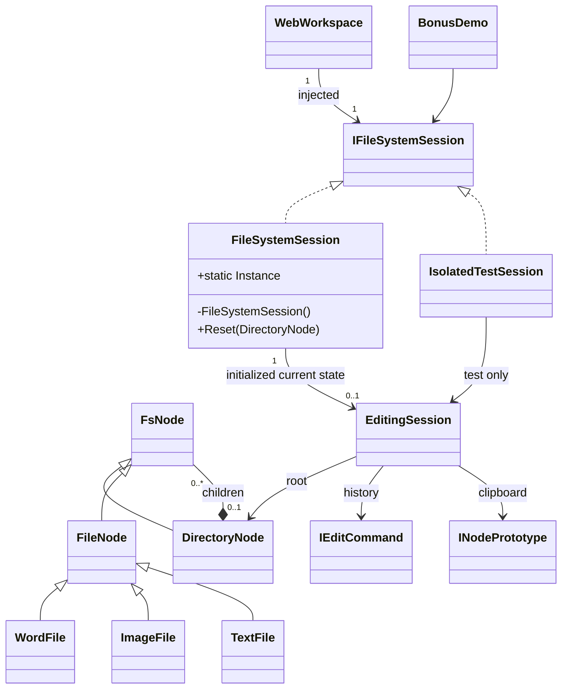

# Proposed UML — Domain unchanged

Application contract and implementation depend on Domain only; Domain never knows Web/DI/session. Root only parentless node, child ownership/cycle/sibling/tag/snapshot invariants unchanged. Test adapter is not production type/registration. All7 Patterns retained: Composite nodes; Strategy sort; Command edits; Visitor operations; GoF Singleton session; Observer progress; Prototype snapshots.
