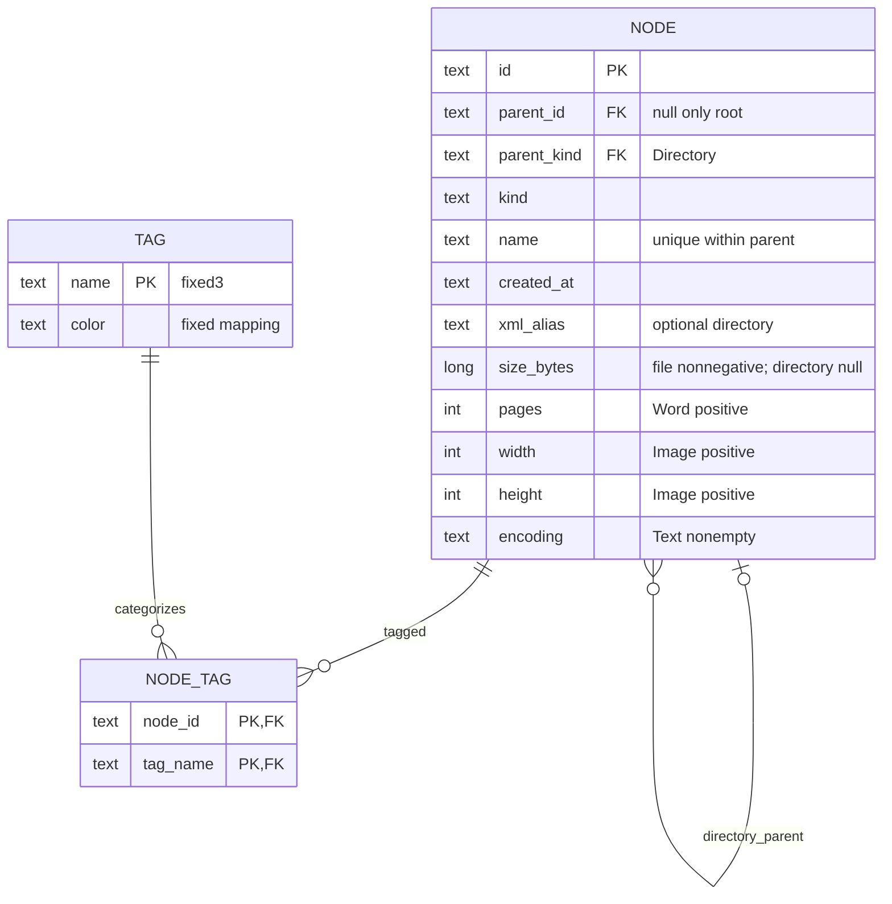

# ER impact — no schema or persistence change

Existing schema.sql/schema-tags.sql remain authoritative: composite parent FK, unique(id,kind), sibling uniqueness, at most one root, subtype nullable/CHECK constraints, immutable id/parent/kind, duplicate tag relation rejected. No stored session/history/clipboard entities. Existing Python SQLite schema verification remains; TASK010 adds no runtime SQLite, EF or Repository.
