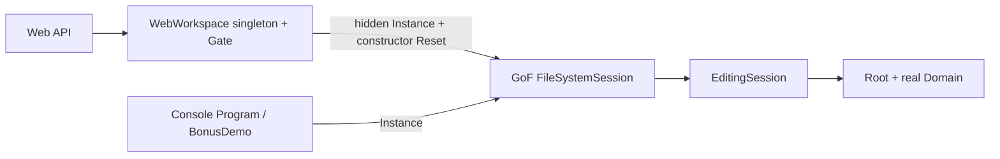
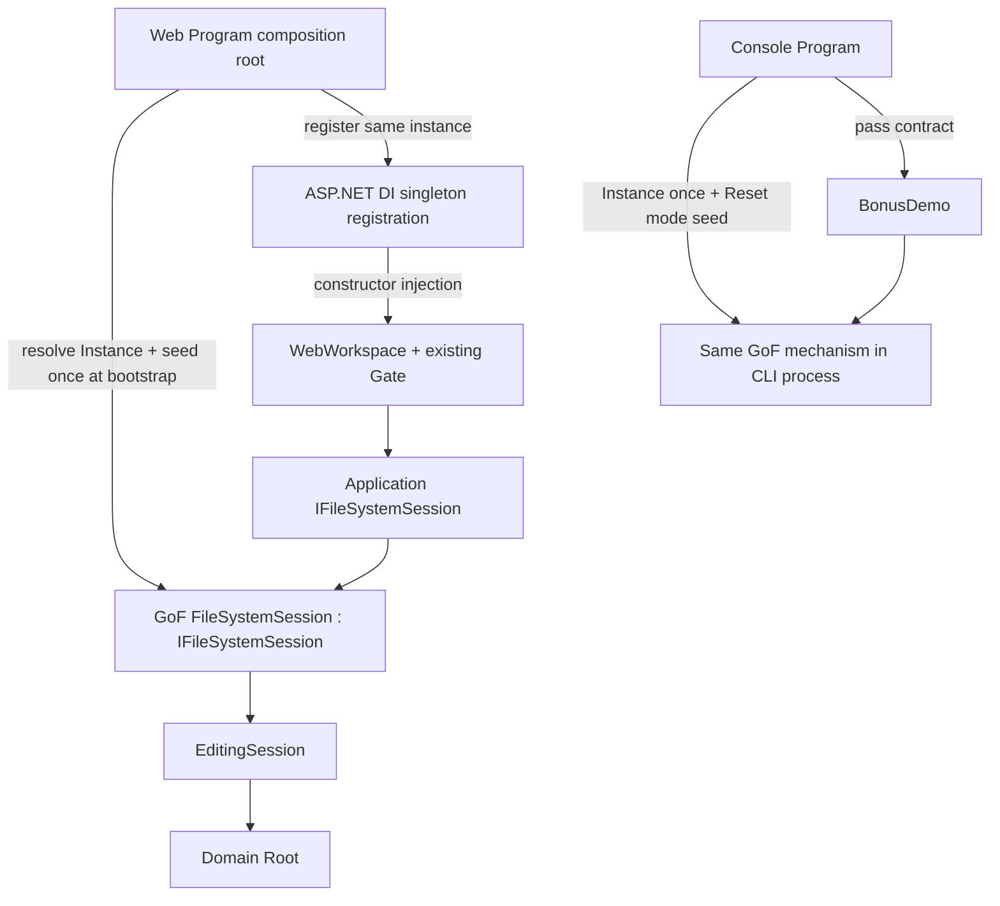
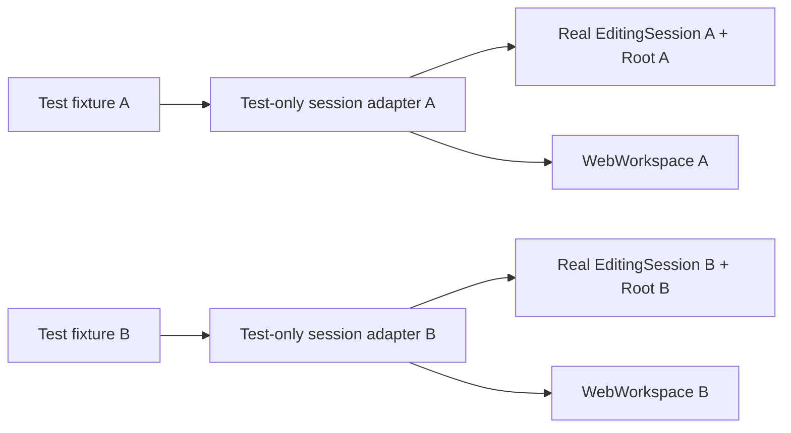

# TASK-009 SA Revision R2 — GoF Singleton + explicit consumer injection
Status: AI_PROPOSAL, awaiting Human architecture approval. Human constraint is confirmed; proposed implementation details are not approved. Supersedes R1 recommendations only; original files remain evidence.

## 1. Decision and actual value
Retain `sealed FileSystemSession`, private constructor, static `Instance` and its actual ownership of Root/current EditingSession/clipboard/history. Make it implement one Application-layer `IFileSystemSession`. WebWorkspace and BonusDemo require that contract through explicit parameters/constructor; no parameterless convenience constructor, static fallback, IServiceProvider/service locator or implementation downcast.

GoF governs instance creation and process-wide production identity. DI supplies that existing object to consumers; registration does not create another FileSystemSession. Both can coexist. This is not replacement by a container-created singleton.

Unlike R1, public concrete constructor injection is not an option: the private constructor stays. Interface now enables a different isolated test dependency without reflection, unsafe uninitialized objects or a second production singleton. It is justified by observable workspace isolation tests and dependency visibility, not by an interface-per-class rule. It does not isolate actual production Singleton state or make it thread-safe.

## 2. Dependency and lifecycle diagrams
Current (unchanged source; detailed inventory remains inventory.md):

Console/Web arrows refer to separate processes in normal deployment, not shared network memory.

Proposed production:

Proposed isolated consumer tests:

No test-only adapter is registered in production. Each isolated test root must be independently built, not shared mutable nodes.

## 3. Interface responsibility / layer
Proposed `Core/Application/Sessions/IFileSystemSession.cs`, same Core project. References concrete Domain nodes and TagKind. Domain never references Application/DI. No interface for Nodes/Visitors/Commands/Sorting/TextWriter.
```csharp
public interface IFileSystemSession
{
    bool IsInitialized { get; }
    DirectoryNode Root { get; }
    int UndoCount { get; }
    int RedoCount { get; }
    bool HasClipboard { get; }
    void Copy(FsNode node);
    FsNode Paste(DirectoryNode destination);
    void Delete(FsNode node);
    bool AddTag(FsNode node, TagKind tag);
    bool RemoveTag(FsNode node, TagKind tag);
    bool Undo();
    bool Redo();
}
```
R2 deliberately excludes Reset from the consumer interface. Lifecycle remains concrete `FileSystemSession.Reset(newRoot)` used by composition/bootstrap and dedicated lifecycle tests; ordinary workspace/demo cannot reset its dependency through this contract. No second lifecycle interface needed. Reset implementation and invalid/same-root semantics remain unchanged. `IsInitialized` allows a clear constructor precondition; ordinary test adapter is always initialized.

`WebWorkspace(IFileSystemSession session, Guid initialSelection)` validates non-null, initialized state and a live selection without mutation; assigns its own local empty logs/matches/idle progress/Size ASC. It must not create ReferenceTree, acquire Instance or call Reset. Root remains mutable through existing Domain API, so this interface is not a security boundary or immutable state guarantee.

## 4. Web composition / registration
Illustrative proposal (not runnable production code committed by this task):
```csharp
builder.Services.AddSingleton<IFileSystemSession>(_ =>
{
    var singleton = FileSystemSession.Instance;
    singleton.Reset(ReferenceTree.Create());
    return singleton;
});
builder.Services.AddSingleton<WebWorkspace>(services =>
{
    var session = services.GetRequiredService<IFileSystemSession>();
    var initialId = /* find the existing API介面定義.docx in session.Root */;
    return new WebWorkspace(session, initialId);
});
```
GetRequiredService is confined to the registration/composition factory, not a service locator in WebWorkspace. The factory returns the exact GoF Instance; no `new FileSystemSession`, proxy history, alternate production state or fallback constructor. Keep initial seed inside factory rather than before registration so a test-host registration override can avoid touching global state. Factory resolution remains lazy as current workspace creation is lazy. Reset occurs once when the sole production host resolves its session registration; not on each request or consumer construction.

Lifetime caveat: this is one registration per provider pointing at the same PROCESS singleton, not one independent session per provider. A second production host/provider in the same process would Reset the same singleton and have a separate workspace Gate. This topology is not supported by this proposal. Do not claim DI solves it or use `if (!IsInitialized)` as an implicit workaround; that would leak previous runtime state. Real production registration tests must be serialized or separate processes. Isolated host tests must replace the registration before service resolution; real registration still has its own integration coverage.

Current application is one host per process. Retain shared Root/clipboard/history AND navigation/log/progress across its clients; no user/session identity or request scope added. GET/POST still use the one WebWorkspace Gate for the full state access/operation. Singleton uniqueness is not thread safety; no Core locking promised. Do not add endpoints that bypass Gate to resolve/mutate the session directly.

Core instance survives provider disposal until process exit. Do not reset global state automatically at host disposal: it could affect another accidental owner. Normal process termination discards state; intentional same-process test reuse needs explicit fixture Reset. No claim of automatic container ownership of the global lifecycle. Existing semaphore teardown may be handled by workspace disposal if later implemented, but does not dispose/recreate Singleton identity.

## 5. Console composition
`Program` alone obtains Instance and initializes the mode-specific sample once. For normal/XML modes use SampleTree; for Bonus add existing Bonus_Copies before Reset, then call `BonusDemo.Run(IFileSystemSession session)` and pass contract to Show. Preserve existing ordering/output/exit behavior. BonusDemo does not access Instance/Reset and no optional parameter/fallback. No CLI DI container needed: explicit parameter injection is enough. Help/invalid args retain early exit.

Allowlisted production static consumers become Web Program's factory and Console Program only. FileSystemSession's own static property definition is not a consumer. Ordinary consumers, Domain and Angular must not gain hidden access. Appropriate architecture checks should verify these specific boundaries, not ban all `Instance` occurrences or break intentional negative test fixtures.

## 6. Isolated dependency used by tests
A small `IsolatedTestSession : IFileSystemSession` lives only under Web test support (test assembly). Constructor accepts a valid root, constructs real `EditingSession(root)`, then stores it; Root getter returns that root, IsInitialized is true, all editing/history/clipboard properties and methods delegate to the real EditingSession. No custom stacks, copy implementation, fake visitor results, canned success values or business-rule reimplementation. No Reset method/lifecycle simulation necessary because the consumer interface excludes it.

This adapter is test infrastructure, not an additional production Pattern or an alternative public session feature. It reuses the actual Commands/Prototype/Domain semantics exercised through EditingSession. It does not verify Singleton initialization/Reset/static identity. That coverage remains on the actual FileSystemSession.

Prevent drift: a shared session-consumer behavior contract runs against (a) isolated adapter and (b) initialized real Singleton under serialized fixture, checking snapshot/conflict/history/noop/undo/redo and error semantics. All existing W01–W20 behavior assertions should remain, ideally parameterized over both fixture modes without duplicating bodies. Ordinary isolated cases must not resolve global Instance even in setup/cleanup. This separation increases test work but avoids asserting that a substitute proves production composition correctness. Counts may grow; coverage remains assertion-based.

## 7. Compatibility / risks
All seven existing production Patterns retained, including actual classic Singleton on real HTTP and Console paths. Interface + DI is a mechanism for access, not a new design pattern demonstration. API/Angular/XML/selection/search/tags/history/progress unchanged; no schema/persistence/new libraries required by this proposal. TextWriter seam unchanged.

Trade-offs: global state and single-host topology remain because stakeholder explicitly requires GoF. Interface adds a second test-only implementation with drift risk; mitigated by real-core delegation plus parity/real-singleton integration. Excluding Reset narrows consumer power but does not stop concrete callers elsewhere from acquiring public Instance; source/dependency checks enforce project convention. Multi-host or true user isolation would need a separately approved lifecycle design; not solved here. Future SQLite still needs separate ownership/transaction design; no scoped database resource should be casually captured by the process singleton. No Repository/EF work now.

This is a bounded compromise for the interview requirement, not a generally recommended global-state service architecture. Extracting a new production session engine solely to make a test instance is rejected for now: existing EditingSession already provides the relevant real behavior. No extra production classes except one interface are proposed.

## 8. Migration sequence after approval only
1. Record R2 Human approval; preserve R1 and rejection. Do not supersede TASK-003 Singleton requirement.
2. Add one consumer interface; FileSystemSession implements it, retaining all existing static/private/lifecycle behavior.
3. Constructor-inject WebWorkspace, move seed/reset to Web factory and inject initial selection. Preserve Gate and response contract.
4. Move Console locator/reset to Program only; pass contract to BonusDemo.
5. Add test-only real-EditingSession adapter, isolated workspace fixtures and parity coverage. Retain A01 child process and true Singleton Reset/serial fixtures; remove unnecessary Reset only from pure visitor/isolated consumers.
6. Add focused composition identity/static-consumer checks and independent-workspace isolation tests; audit safe parallel collections, retain Console.Out isolation.
7. Execute existing 72 C# obligations (architecture6 included) plus new tests, Python18/Angular8, Release/Console/Web/browser XML/ReferenceA/B. No A01 GoF assertions may be replaced/deleted. Preserve failures/REWORK. No verification runs in current SA-only phase.
