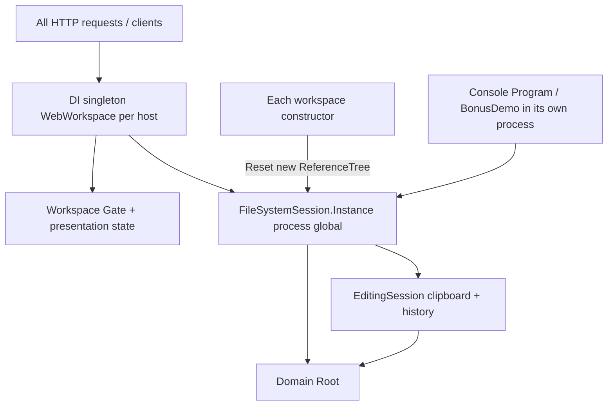
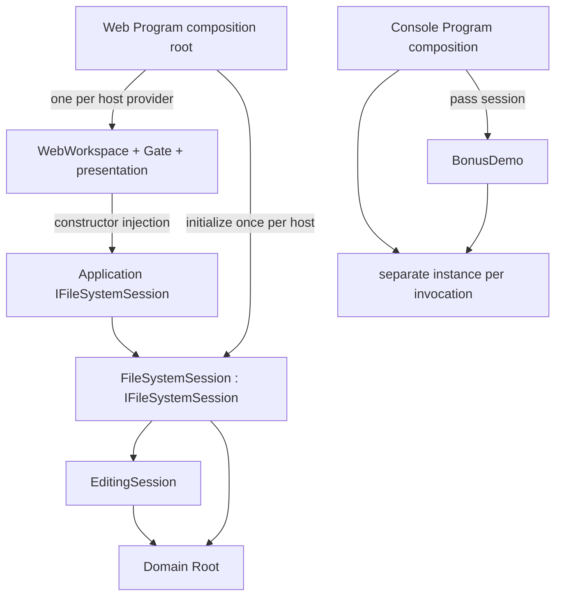

# TASK-009 proposed architecture R1
Status: AI_PROPOSAL / awaiting Human architecture approval. R01–R08 mapped below. No implementation performed.

## Current dependency/lifecycle

The Console arrow describes its own process-local static, not network sharing. See inventory.md for exact callsites. Global session is an inherited TASK-003 implementation choice, not required by HTTP or by the Domain model. Web needs continuity across requests, not CLR-global uniqueness.

## Proposed target and lifetime

Application → Domain only. No Domain dependency on interface, Web, Microsoft.Extensions.DependencyInjection, provider or HttpContext. Existing Core.csproj remains single assembly. Framework registrations live only in Web Program. Interface/implementation both in Core/Application/Sessions. No new project or general service locator.

## Proposed interface (contract sketch, not production code)
```csharp
public interface IFileSystemSession
{
    bool IsInitialized { get; }
    DirectoryNode Root { get; }
    int UndoCount { get; }
    int RedoCount { get; }
    bool HasClipboard { get; }
    void Reset(DirectoryNode newRoot);
    void Copy(FsNode node);
    FsNode Paste(DirectoryNode destination);
    void Delete(FsNode node);
    bool AddTag(FsNode node, TagKind tag);
    bool RemoveTag(FsNode node, TagKind tag);
    bool Undo();
    bool Redo();
}
```
One cohesive runtime editing/session contract, not data storage. Root remains concrete Domain node; Commands/Visitors/Sorting/Nodes unchanged. Reset is explicit owner-only-by-convention lifecycle operation, not API action or history. Interface does not enforce exclusivity or thread safety; retaining mutable Root is a documented limitation. Splitting lifecycle/query/editor into three interfaces adds no demonstrated benefit now.

FileSystemSession gets public parameterless construction, initially uninitialized, keeping existing state guards and Reset validation/delegation. Static Instance/private-constructor requirement removed only after Human approval. No compatibility static alias: that would keep hidden process global and undermine improvement.

## Web composition sketch
```csharp
builder.Services.AddSingleton<IFileSystemSession>(_ => {
    var session = new FileSystemSession();
    session.Reset(ReferenceTree.Create());
    return session;
});
builder.Services.AddSingleton<WebWorkspace>(services => {
    var session = services.GetRequiredService<IFileSystemSession>();
    var initialId = /* locate existing API介面定義.docx in seeded root */;
    return new WebWorkspace(session, initialId);
});
```
WebWorkspace constructor receives initialized session and valid initial selection ID, validates without mutation, initializes only its local navigation/log/progress defaults. It must never Reset or create the sample. Existing traversal can locate initial node at composition; no domain search semantics change or generic factory pattern needed. Use real session in tests, optional root-selected fixtures when no reference API node exists.

Same provider resolves exactly one session and one workspace. Fresh service provider gets fresh root/session/workspace. No BuildServiceProvider inside registrations. No scoped session captured by singleton; no static root/sample cache. DI factory initializes once on first resolution, matching existing lazy workspace initialization. DI-owned WebWorkspace should dispose its existing semaphore at host teardown; no resource abstraction added. Root/editor state is managed memory, discarded on host termination. Stop accepting operations before teardown as normal host lifecycle; no new shutdown endpoint.

## Ownership / sharing / synchronization decision
Recommendation preserves all requests/clients in a given host sharing Root, Clipboard, Undo/Redo AND existing selected node/sort/logs/progress/highlights. Independent user workspaces are NOT introduced: current API has no user/session discriminator. For a real multi-user product this shared history may be undesirable; such a change needs separate product requirements. Approval must explicitly accept retained demo sharing.

Each independently constructed test workspace owns an independent session and independently created Root; do not create two session objects around the same mutable Root and call that isolation. Reset remains non-thread-safe and must not race; Web has no Reset route. All HTTP State/Execute accesses continue through the SAME existing workspace Gate, including projection. Do not inject/use session directly from new endpoints bypassing Gate. Different independent workspaces can run concurrently; same session stays serialized. Container singleton does not make mutable state thread-safe. Session implementation introduces no locks; existing Web synchronization remains at owner boundary. Multiple workspaces sharing one session are unsupported topology because their gates and navigation differ.

## Console
Program is composition root: for normal/XML modes create SampleTree, instantiate session and Reset once; for Bonus build the existing sample plus Bonus_Copies before session initialization, pass initialized IFileSystemSession to BonusDemo.Run/Show. Preserve stdout/exit codes and operations/order. No DI container/Generic Host required merely to pass a dependency. One instance reused for entire invocation; separate CLI process never shares Web memory. Help/invalid args retain early exit.

## Compatibility and scope
Angular sources and request/response/NDJSON shape unchanged. GET state, action names/errors, XML bytes/filename transport, real traversal events, independent selection/matches, sorting, tags/counts, copy snapshot/conflict/noop/history, Reset clearing and invalid Reset preservation unchanged. Seven-pattern responsibilities unchanged except Singleton mechanism explicitly superseded per ADR; no claim classic GoF remains. All other patterns remain production-used.

No persistence, auth/user-session registry, DI for pure functions, ID provider, interface proliferation, Repository, EF, schema, TextWriter or test-framework migration. No historical edits. Current API C# constructors/static access are intentionally changed call-sites after approval; network/product contract remains stable.

## Required future verification
See testability-map.md: assertions, not case count alone. Retain existing 72 C# obligations except specifically approved GoF-mechanism replacements; add isolation/composition tests, so final count may change. Keep architecture6, Python18, Angular8, Release build, Console/Web smoke, real XML and Reference A/B. No such tests run or claimed PASS in this analysis phase.

## Requirement mapping
R01 inventory/current diagram; R02 unchanged scope; R03 options.md; R04 interface/composition/layer diagram + domain-model/er-model; R05 testability-map; R06 compatibility + migration sequence; R07 ADR/human-decisions; R08 baseline manifest + review protection check.

## Migration sequence after approval only
1. Append Human approval/answers; resolve ADR and sharing decision before any DEV.
2. Add one Application interface; make FileSystemSession independently constructible, retain Reset behavior; migrate all static consumers and targeted tests together.
3. Move Web seeding/initial selection to Program registration, inject dependency, remove constructor Reset; preserve singleton workspace and gate ownership.
4. Centralize Console session composition; pass dependency to BonusDemo, retain output contract.
5. Replace global-reset fixtures with fresh instances/roots. Replace A01 GoF-only checks under approved mapping; add provider lifetime and workspace-isolation tests. Audit architecture negative fixtures still trigger guard.
6. Enable only proven-safe parallel test collections; keep actual Console.Out capture serialized. Real server/download setup remains.
7. Run full regression/coverage, browser/reference checks, production scope audit. Update current-facing docs about container-managed Singleton; never TASK-001～008 history. Preserve any failure/REWORK.

## Risks / trade-offs
- One extra interface duplicates public surface; isolation benefit comes from instance ownership, not mocking.
- Host-shared mutable user state remains by design; not a scalable multi-user service guarantee.
- Removing Instance breaks external C# callers/classic GoF assertions; all repository consumers must migrate, no silent alias.
- Leaked Root or direct session access can bypass gate; no general thread-safety guarantee added.
- Session factory + workspace must have matching lifetime; scoped/transient substitutions are behavior changes.
- Reset while workspace active invalidates navigation; only bootstrap/no Reset API here. A future live reset requires workspace presentation reset design.
- Multiple providers now isolate by design; this intentional change from process-global semantics requires approval.
- Future SQLite lifetime is undecided; do not inject a scoped DB context into host singleton or equate persistence with clipboard/history.
