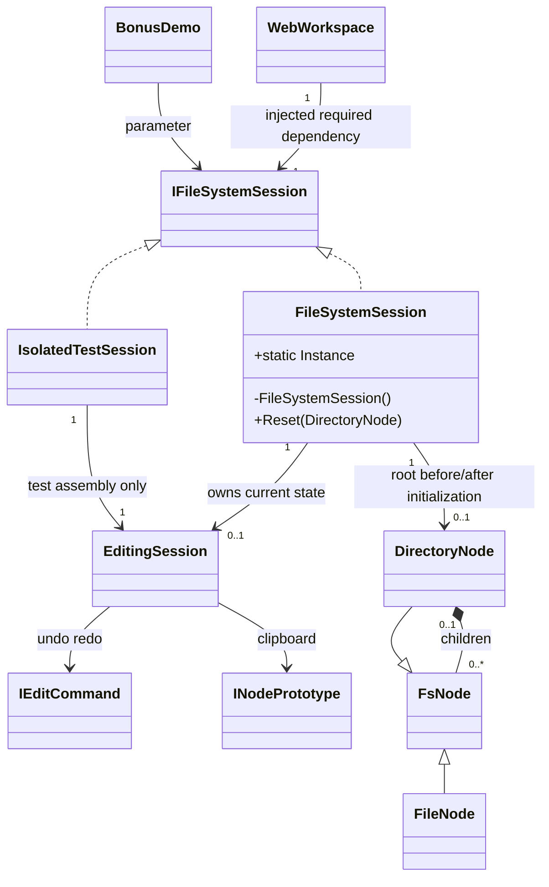

# R2 UML and ER impact

Interface/Singleton/EditingSession are Application; nodes/Prototype contract are Domain; test adapter exists ONLY in test assembly and is not registered in production. Production is one workspace/Gate per process singleton. Isolated test instances do not change classic Singleton identity.

R1 domain-model session dependency sketch is superseded by this diagram. Its node inheritance/invariants and er-model.md remain applicable unchanged: no new table, PK/FK, persistent session, schema or database. Application→Domain only; Domain no DI dependency. Composite/Strategy/Command/Visitor/Observer/Prototype unchanged; GoF Singleton explicitly retained, not superseded.
