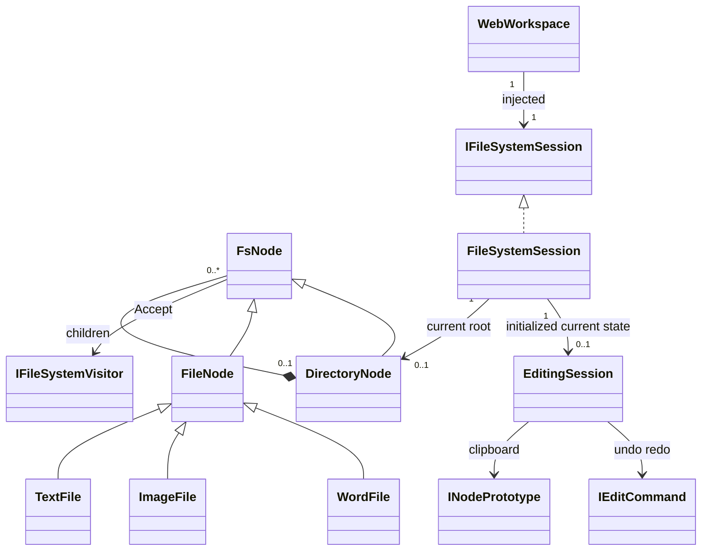

# Proposed UML / responsibility boundary

Domain entities/contracts unchanged; Application session interface references Domain, never inverse. Root is only parentless node; no multiple parents/cycles, sibling name conflict and clone/history identity unchanged. WebWorkspace is presentation/API orchestration. One initialized WebWorkspace per session in production topology; test fixtures create independent roots/session/workspace triples. No FK or persisted session model implied.
Composite/Strategy/Command/Visitor/Observer/Prototype responsibilities unchanged. Singleton mechanism changes only per proposed ADR; diagram does not assert process-global uniqueness.
