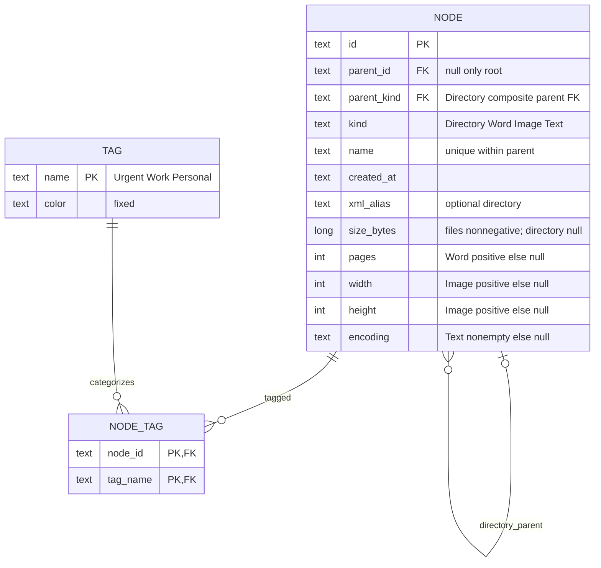

# ER impact — unchanged, no persistence implementation
Authoritative existing schema.sql/schema-tags.sql and TASK-007 ER remain unchanged. This diagram restates relevant storage constraints, not a new persistence proposal.

Existing composite parent FK, unique(id,kind), one-root partial unique index, sibling uniqueness, subtype checks, immutable id/parent/kind and Tag uniqueness remain. Clipboard/history/session/selection/progress are not schema entities. No session table, database connection, EF model or Repository proposed. Future SQLite work must separately decide durable content vs transient state and connection/transaction lifetime; no schema changes here.
