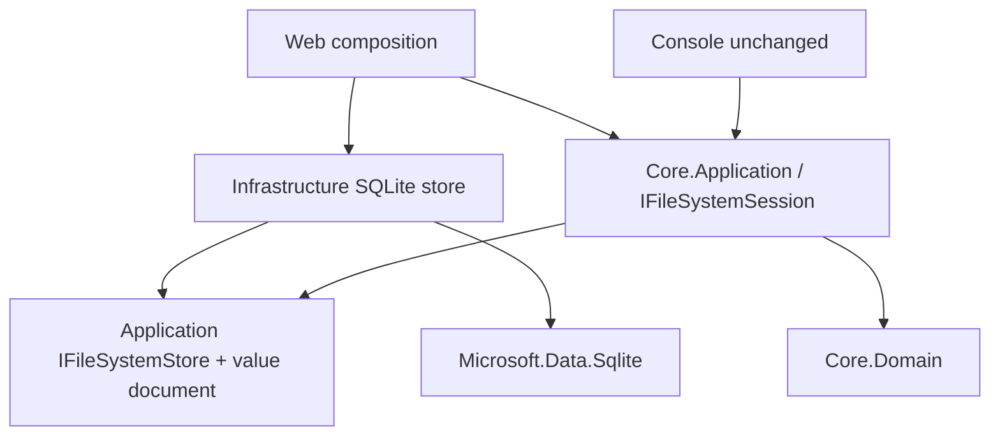
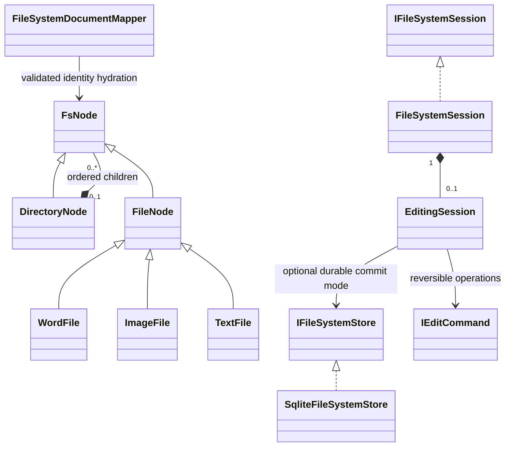

# Proposed dependencies / domain model

Arrows are source dependencies. Domain never depends on Application/Infrastructure. SQL mapping consumes value documents, not direct Domain mutation.

Store binding absent in Console/in-memory tests; explicit bootstrap enables durable mode only in Web. Existing constructor overloads preserve in-memory compatibility. No new production session implementation.
