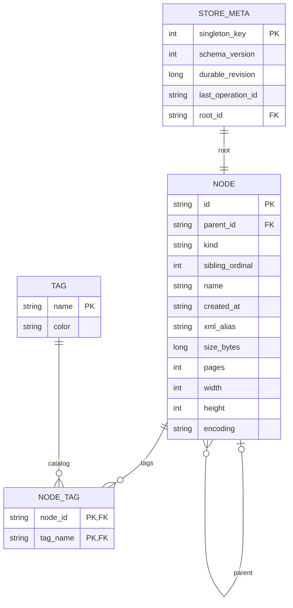

# Proposed schema and mapping (not applied)

TPH kinds map DirectoryNode→Directory, WordFile→Word, ImageFile→Image, TextFile→Text. Root parent null, other parent Directory; stable Guid canonical D representation; DateTimeOffset roundtrip O preserves offset/ticks. Exact long bytes, positive bounded int metadata, encoding and Directory XmlAlias retained. Derived FullPath/Extension/Directory capacity omitted. Tags fixed catalog, join unique(node,tag).
New sibling_ordinal nonnegative integer, UNIQUE(parent_id,sibling_ordinal); loader enforces contiguous0..n-1 and root ordinal0, Children order independent of display sort. Retain sibling name BINARY case-sensitive uniqueness compatible with Ordinal equality; validate .NET string rules on hydration rather than assuming SQLite trim matches Unicode whitespace. Reject invalid Guid/date/type/enum/range/cycle/orphan/disconnected rows. At-most-one root SQL index does not guarantee exactly one; loader and metadata do.
Existing schema lacks order/version/receipt; timestamp/id validation weak; metadata has no Int32 upper bounds. Existing immutable structure trigger compatible with full-delete/reinsert save; delete child-first, insert parent-first. Root metadata FK deferred to transaction commit (old root temporarily absent during replace). SQL v1 separate Infrastructure resource, retain root schema.sql/schema-tags.sql and Python18 as original assignment contract; new integration tests verify v1 and parity. No production database currently exists to auto-upgrade; unversioned demonstration DB is rejected rather than silently adopted.
No clipboard/history/selection/log/progress tables. Schema lifecycle transaction writes version only after success. No ON DELETE cascade assumption for node parent (existing FK lacks it); explicit order required.
