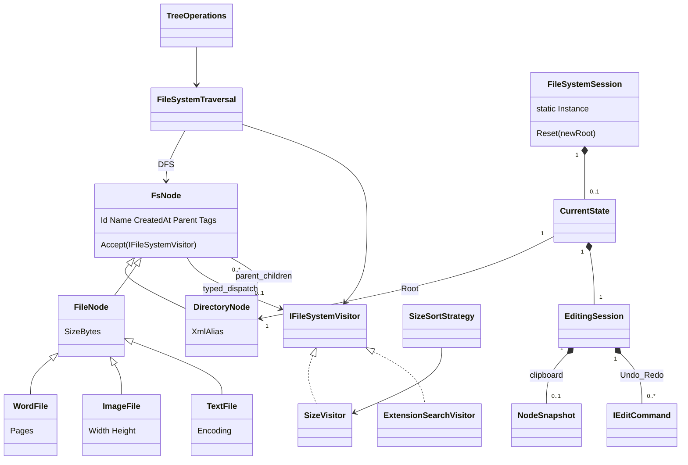

# Domain model v1

CurrentState為私有實作，初始化後恆有一個Root及EditingSession，Reset替換state但保留Singleton identity。FsNode ownership/Parent readonly/Children只讀不變；Visitor不修改topology。Tag catalog及三類metadata沿用TASK-002。
