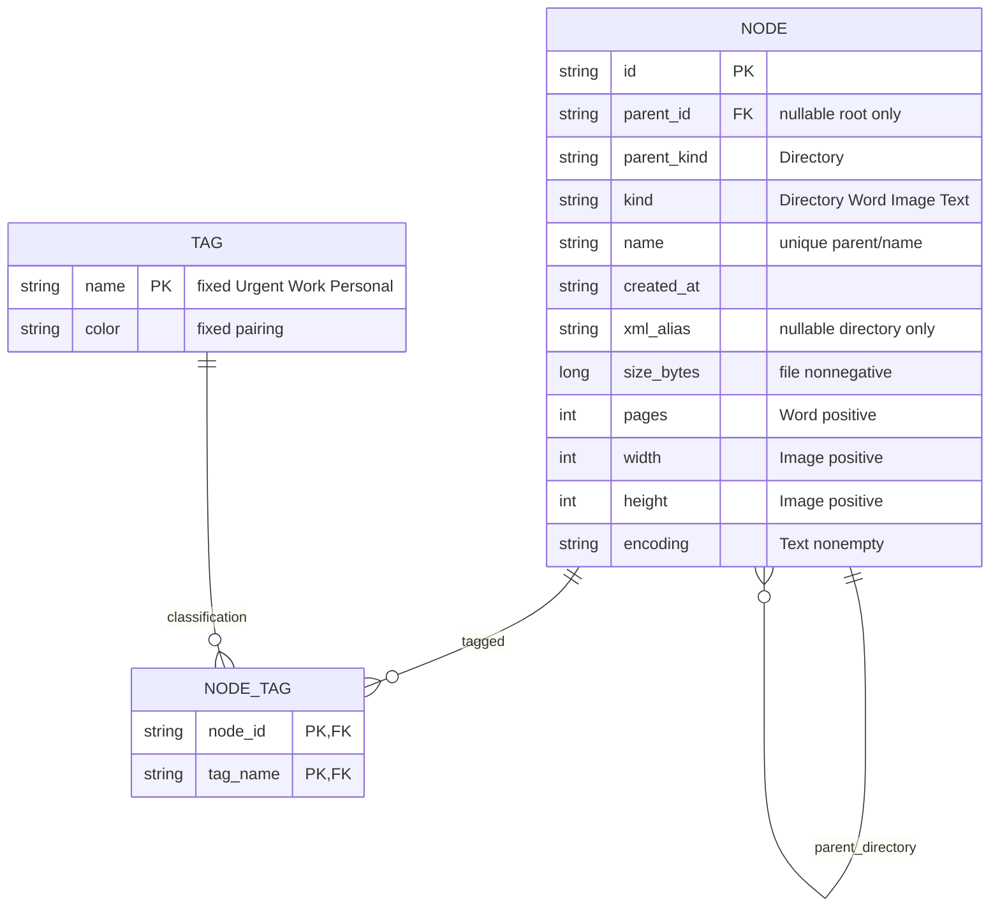

# ER model v1 — schema unchanged

schema.sql/schema-tags.sql byte-identical；原single-root、parent-kind FK、immutable topology、metadata CHECK、node_tag NOT NULL複合PK/FK與cascade均沿用。Visitor無儲存資料；FileSystemSession/CurrentState/clipboard/history為記憶體runtime，不新增SESSION表、不假稱Reset持久化或清DB。ER只描述domain持久化模型，application目前仍不連DB。
