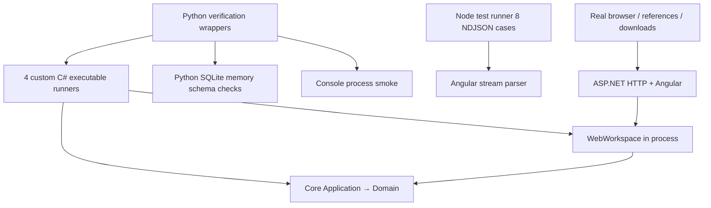
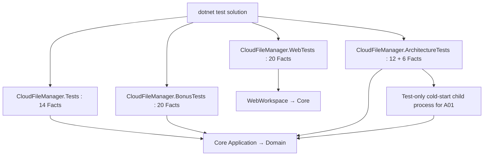

# TASK-008 SA design R1 — proposal pending Human approval

## 1. Current testing architecture

Current failures caught by custom Test wrappers and aggregated integer exit; discovery is textual PASS/RESULT, no standardized per-case test report. A01 depends on process startup/order. B04 temporarily replaces Console.Out. W12 assumes repo cwd. Existing W suite is not HTTP integration.

## 2. Target and project trade-off
**AI_PROPOSAL: retain four existing test project paths**, convert each to xUnit v3 using VSTest adapter + Microsoft.NET.Test.Sdk, net10.0. Stable package versions must be explicitly pinned after approval and restore compatibility demonstrated; no prerelease adoption from documentation examples. Do not modify production project references or add production test hooks. IsTestProject/IsPackable and generated xUnit entry point follow selected stable package requirements; remove custom top-level counters/Main. Framework-generated entry point is not the old runner.

| Option | Benefit | Cost / decision |
|---|---|---|
| Single test project | few packages/configs, easy command | Web reference contaminates all test dependency closure; churn merges suites; not selected |
| New Domain.Tests/Application.Tests/Architecture.Tests/Web.Tests | names align layers, selective assembly runs | mixed legacy cases need splitting and rehoming fixtures; no production assembly boundary; avoid scope-expanding rename/reclassification this migration |
| Convert four existing projects, folders/classes/traits | minimal movement; preserved baseline grouping and references; Web separate | historic names are imperfect, duplicate configuration; selected for bounded migration |

Test classification follows responsibility, not project name. For future growth a separately approved task can split suites; no need now.



## 3. Proposed structure
```text
tests/
  CloudFileManager.Tests/             # retain csproj & Fixtures bytes
    Domain/DomainContractTests.cs
    Application/AssignmentRegressionTests.cs
  CloudFileManager.BonusTests/
    Application/SortingTests.cs
    Application/EditingTests.cs
  CloudFileManager.ArchitectureTests/
    Behavior/VisitorBehaviorTests.cs
    Behavior/SessionLifecycleTests.cs
    Architecture/LayerDependencyTests.cs
    LayerDependencies.cs              # keep compiled guard algorithm
    ColdStartProbe/                   # test-only helper executable, NOT test runner
      ColdStartProbe.csproj
      Program.cs
  CloudFileManager.WebTests/
    WebWorkspaceTests.cs
    Fixtures/                        # linked expected.xml copied to output
  verify_schema.py                   # unchanged
  verify_tag_schema.py               # unchanged
spaces/xunit-test-migration/          # new mapping/run evidence only
```
No shared production interface, InternalsVisibleTo, database package, or DI change. Helper build referenced with ReferenceOutputAssembly=false, excluded from parent Compile glob; copy helper DLL/deps/runtimeconfig and dependencies to distinct output folder. Helper never loaded into parent host; spawned with current dotnet host and argument list, bounded timeout, stdout/stderr captured, killed on timeout. A01 Fact asserts helper exit and structured report for **each** original A01 expectation; crashes/missing report fail. This is not a PASS text parser around all old cases. No helper responsible for other72-case execution. No `dotnet run` recursive build inside tests; helper built in advance.

## 4. Isolation / assertion design
- xUnit per-test fresh objects; never mutable static/shared root fixtures. T baseline root freshly built per case; fixture data immutable read/disposed.
- Disable test parallelism inside all four assemblies initially, reflecting original serial execution and avoiding Console.Out/global singleton hazards. Independent testhost processes may run different assemblies. Costs some potential speed, acceptable at this scale; no product locks added.
- Session cases reset clean root before and in cleanup/finally after. Web tests each create WebWorkspace and reset session after case even on assertion failure. Reset cannot return IsInitialized to false: **A01 must run in fresh child process**, not ordered first and not reflection overwrite.
- B04 Console.SetOut retains try/finally restoration; framework diagnostics go to ITestOutputHelper. Avoid swallowing exceptions into custom result counters.
- Existing internal Commands/NodeSnapshot exercised through public EditingSession/Copy/Paste. No visibility widening for testing.
- W12 linked fixture copied to test output, resolved by AppContext.BaseDirectory; no chdir/global cwd mutation.
- Map exact sequences/reference identity, negative exceptions and loops. Original catch(T) semantics require ThrowsAny<T> when derived types permitted. Treat analyzer warnings intentionally; no blanket suppressions to get green.

## 5. Execution strategy (planned, NOT_RUN)
From repository root, after approved migration:
```sh
dotnet restore CloudFileManager.slnx
dotnet build CloudFileManager.slnx -c Release -t:Rebuild
dotnet test CloudFileManager.slnx -c Release --no-build --list-tests
dotnet test CloudFileManager.slnx -c Release --no-build --logger trx --results-directory spaces/xunit-test-migration/test/evidence/r1/trx
python3 tests/verify_schema.py
python3 tests/verify_tag_schema.py
npm --prefix src/CloudFileManager.Angular test
npm --prefix src/CloudFileManager.Angular run build
```
Also demonstrate plain `dotnet test` from repo root plus per-project invocation from its directory. No requirement to install a custom runner command. Each mapped ID must be discovered, executed, not skipped, with TRX evidence. Use `--filter LegacyId=A01` etc. to prove selected-case execution and repeat full suite; filters must not silently select zero. No reliance on stdout RESULT strings for xUnit success.
New TASK008 verification orchestrator can aggregate xUnit TRX, retained Python outcomes, Console smoke and SHA256, but cannot mask exit codes or manufacture tests. Record command/cwd/tool versions/exit/start/end/stdout/stderr. Preserve failure attempts under new rN folders.

## 6. Exit-code negative control
After approval, create disposable copy of test configuration/source outside final suite with one intentional failing Assert (and control passing case). Invoke same dotnet test platform/packages, retain nonzero exit/TRX identifying failure. Stronger check: temporarily mutate assertion only in disposable copy of a migrated case and demonstrate failure; never modify production or leave failing branch/conditional environment behavior in shipped suite. Record copy input/diff/hash and cleanup boundaries. Formal tests then run against unchanged final working tree with all mapped IDs.

## 7. Coverage preservation / non-xUnit verification
migration-map.md/json cover72 original obligations with source hashes and target method. DEV adds implemented paths/assertion mapping; TEST audits all old bodies and loops, independent source oracle, negative controls, fixtures/ID/order and state isolation. No skipped tests, removed assertions, or test-count-only certification. 72 need not remain exact method count if documented Theory split, but default proposal one Fact per legacy case makes comparison easy.
Retain Python12+6 (schema contract), Angular8 (stream-parser) independently. Thus old84 baseline =66 C#+18schema, plus6layers, plus8Angular=98 obligations. TRX72 alone is not98 PASS.
Rebuild and Console sample/XML/bonus/invalid-exit smoke; run real Web/API smoke and browser XML/download/Reference A/B check with unchanged frontend hashes, new evidence under TASK008. Do not claim W12 alone verifies MIME/download or W suite verifies transport. Browser limitations must be BLOCKED, not invented PASS. No coverage-driven product changes.

## 8. Python decisions
- verify_schema.py / verify_tag_schema.py unchanged: in-memory SQLite validates existing SQL only; no EF/runtime DB dependency introduced.
- tests/run_task002/003/004_verification.py and all old spaces/* runners remain untouched and explicitly baseline-specific. Their old custom-runner commands are not advertised as current entry point.
- New TASK008 runner planned after approval, consuming xUnit results. Update current README testing instructions then, not historical artifacts.

## 9. Migration sequence / R mapping
1. Human architecture approval required (R10).
2. Fresh baseline run custom72 + retained18/8; immutable source/body/fixture mapping hashes (R01/02/08).
3. Pin stable compatible xUnit v3, VSTest adapter/Test SDK; convert four test csproj/config only (R03).
4. Extract Facts with helpers/fresh state; cold-start process, fixture location, Console cleanup (R01/06).
5. Migrate six layer checks without altering analyzer or negative controls; audit full72 assertions (R02/05).
6. Add new reporting/orchestrator and current test docs; retain legacy history (R07/08).
7. Discovery, single-case + repeat run, controlled failure exit, full regression and smoke/browser evidence (R03/04/07).
8. DEV Grill Me, TEST independent role check, allR evidence, final diff/history hashes. Do not commit/push (R08–10).

## 10. Risks / trade-offs / Human decision
Global state requires serial test assemblies and helper process overhead. More package restore/network dependency; failure is tooling BLOCKED, not permission to weaken tests. xUnit analyzers may expose incorrect assertion semantics; compare originals before changing. Assembly IL checks may see compiler differences; preserve TASK007 synthesized-container handling and test-only negative controls. No concurrency/thread-safety promise added.
No assembly split of Core. No production interfaces, new pattern, storage, EF, Repository, xUnit-enabled conditional production branch.
**Human decision required before DEV: approve this four-project conversion + test-only cold-start probe + serial isolation + preserved Python/Angular/browser responsibilities.** Framework patch versions are DEV implementation details, documented after actual restore, not extra product questions. SA Gate can PASS as a complete proposal while task remains BLOCKED awaiting approval.

## Official framework references (read 2026-09-27)
- [xUnit v3 getting started](https://xunit.net/docs/getting-started/v3/getting-started): framework and VSTest adapter/Test SDK integration; current example includes prerelease, not a version recommendation here.
- [Shared context](https://xunit.net/docs/shared-context): test instance/fixture lifecycle.
- [Parallel execution](https://xunit.net/docs/running-tests-in-parallel): execution configuration; exact selected stable-version config verified in DEV.
- [v2 status](https://xunit.net/docs/getting-started/v2/getting-started): maintenance mode; favors stable v3 for new migration. No packages installed this phase.
