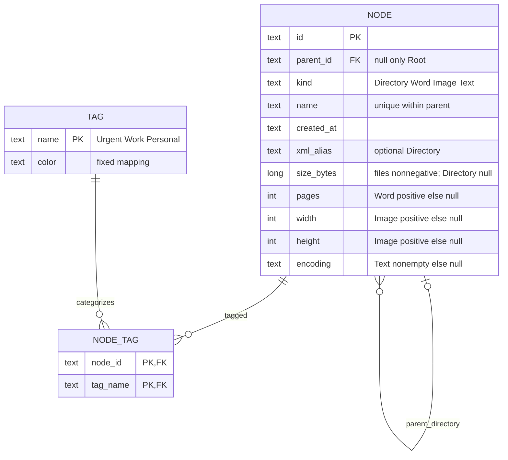

# TASK-008 model impact — unchanged

This task changes test infrastructure only. Diagram restated from TASK-007 approved model; no proposed production/schema change.

Domain → Application remains forbidden; Application → Domain allowed. Root-only null parent; sibling names Ordinal unique; child ownership and identity preserved. NODE/NODE_TAG PK/FK and fixed tag catalog constraints continue to be checked by unchanged Python/schema fixtures. No persistent session/history is introduced. Detailed constraints remain in baseline schema.sql/schema-tags.sql and TASK-007 sa/er-model.md.
